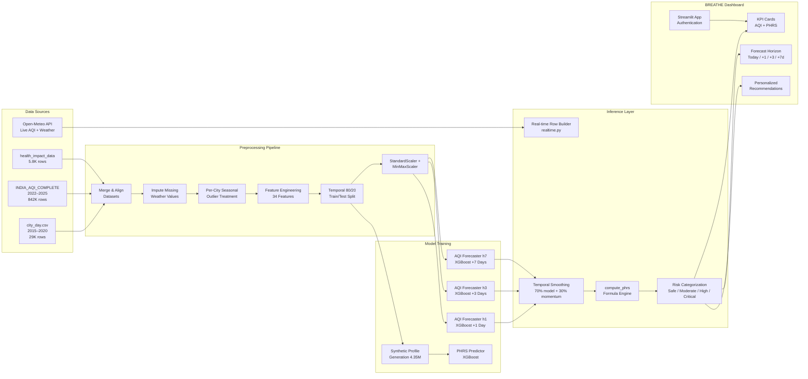
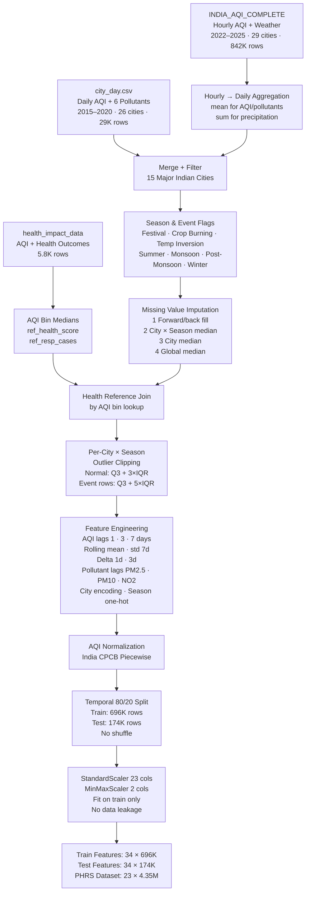
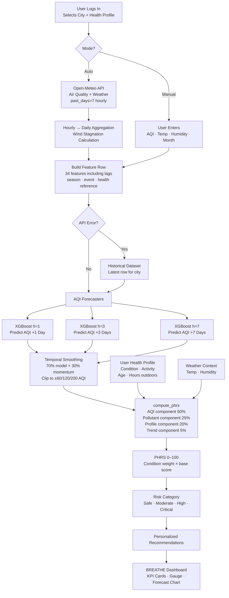
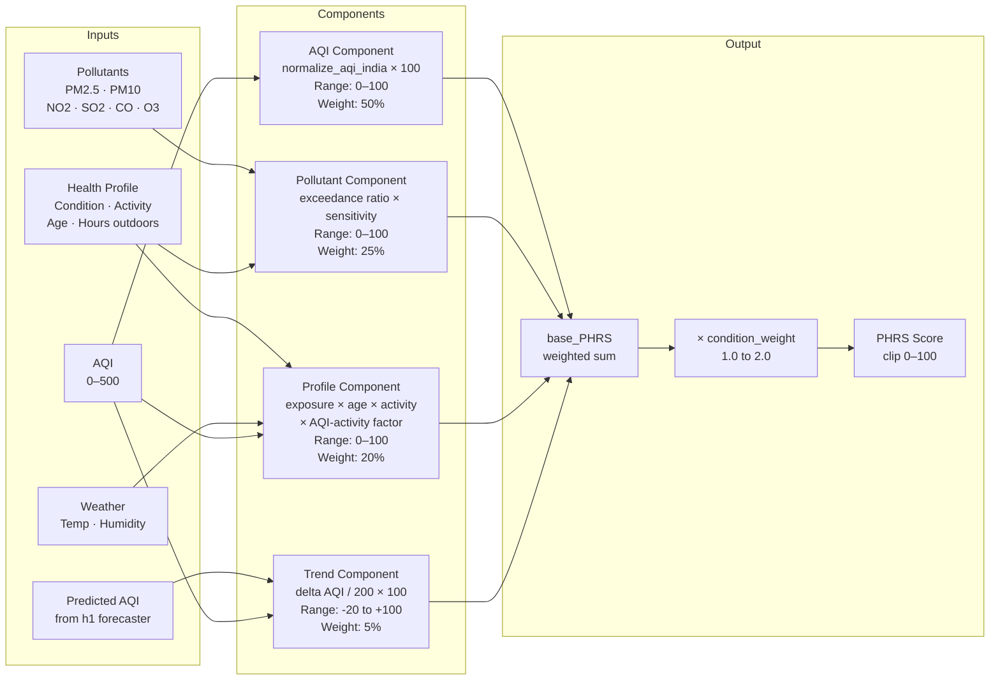
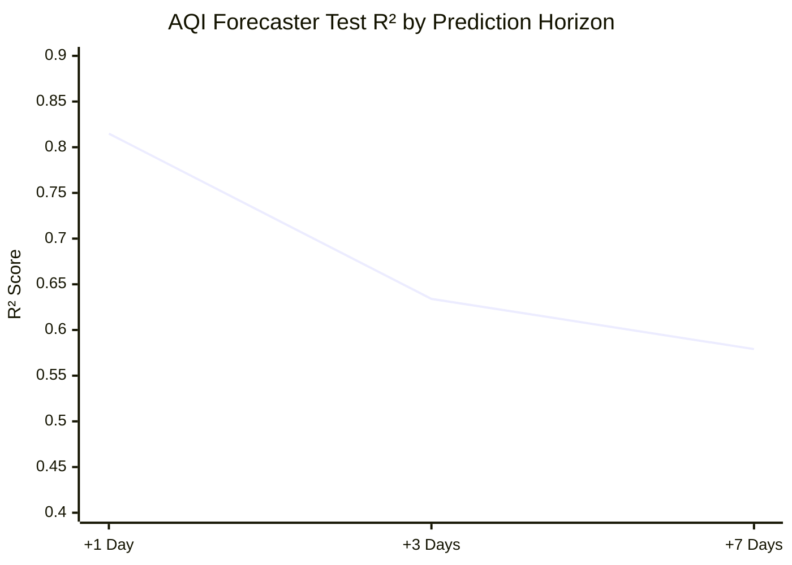
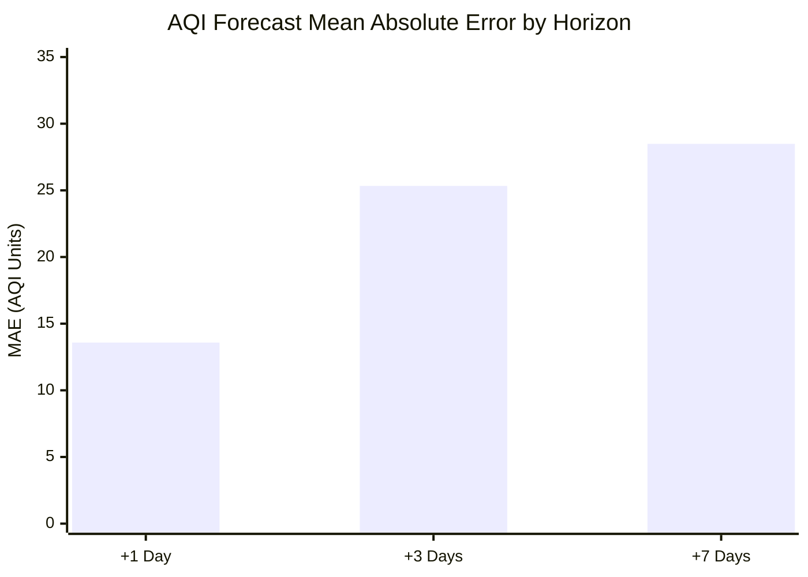
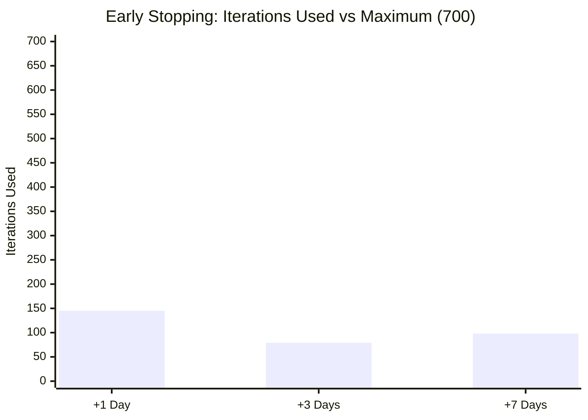

# BREATHE: Biometric Real-time Environmental Air-quality and Treatment Health Engine

**A Personalized Air Quality Risk Prediction System for Indian Urban Populations**

---

## Abstract

Standard Air Quality Index (AQI) systems broadcast a single value to all citizens equally, failing to account for the dramatically different risk profiles of children, the elderly, individuals with respiratory or cardiac conditions, or those who spend extended time outdoors. BREATHE addresses this gap by combining multi-horizon AQI forecasting with a Personal Health Risk Score (PHRS) that integrates individual health conditions, activity levels, weather parameters, and pollutant composition. The system trains three XGBoost regression models on 870,000+ records spanning 15 major Indian cities (2015–2025) and achieves a 1-day AQI forecast R² of **0.8149** (MAE = 13.58 AQI units) with graceful degradation at 3-day (R² = 0.634) and 7-day (R² = 0.579) horizons. The PHRS predictor achieves R² = **0.9991** on held-out data with 5-fold cross-validation R² = 0.9985 ± 0.0003. A Streamlit dashboard integrates real-time Open-Meteo API data, user health profile management, and a 7-day forecast horizon view.

---

## Table of Contents

1. [Introduction](#1-introduction)
2. [Literature Review](#2-literature-review)
3. [Proposed Architecture](#3-proposed-architecture)
4. [Prediction Model](#4-prediction-model)
5. [Experimental Setup](#5-experimental-setup)
6. [Results](#6-results)
7. [Ablation Study](#7-ablation-study)
8. [Conclusion](#8-conclusion)
9. [References](#9-references)

---

## 1. Introduction

### 1.1 Background

Air pollution is the largest single environmental health risk globally, causing approximately 7 million premature deaths annually (WHO, 2022). In India, 21 of the world's 30 most polluted cities are located within its borders. The Central Pollution Control Board (CPCB) publishes daily AQI values for major cities through the SAMEER application — but this single number treats a sedentary healthy adult identically to a child with severe asthma or an elderly cardiac patient performing outdoor exercise.

### 1.2 Gap Analysis

**Current limitations of existing AQI systems:**

| System | Personalization | Forecasting | Weather Interaction | Real-time |
|--------|----------------|-------------|---------------------|-----------|
| CPCB SAMEER | None | None | None | Yes |
| IQAir | None | 3-day (generic) | Partial | Yes |
| AirVisual | None | 7-day (generic) | None | Yes |
| WHO AQI Guidelines | Static categories | None | None | No |
| **BREATHE** | **Full (7 conditions, 4 activity levels)** | **1/3/7-day** | **Full (temp, humidity, inversion)** | **Yes** |

**Identified gaps BREATHE addresses:**

1. **Gap 1 — No health personalization:** A PM2.5 reading of 90 µg/m³ poses fundamentally different risks to a healthy adult vs. a child with severe asthma. Existing systems do not differentiate.

2. **Gap 2 — No integrated multi-day forecasting:** AQI predictions exist but are not translated into personalized health risk for the coming days.

3. **Gap 3 — Weather × health interaction ignored:** Temperature inversions, extreme heat, and fog dramatically alter pollutant concentration and inhalation dose, yet these interactions are absent from current advisories.

4. **Gap 4 — Static, generic recommendations:** Advisories like "sensitive groups should limit outdoor activity" are not tailored to the user's specific condition, activity level, or hours of outdoor exposure.

5. **Gap 5 — Activity-level risk amplification:** A sedentary person and a marathon runner experience radically different inhaled pollutant doses even at the same AQI level. This dose-response relationship is well-documented in literature but absent from public health tools.

### 1.3 Contributions

BREATHE makes the following novel contributions:

- **PHRS formula:** A weighted additive scoring function combining four components (AQI, pollutant exceedance, personal profile, AQI trend) calibrated against health impact data and peer-reviewed literature.
- **AQI-activity interaction:** An AQI-dependent activity multiplier that reflects the epidemiological finding that physical activity is protective at low AQI but harmful at high AQI.
- **Multi-horizon XGBoost forecasting:** Three temporally-separated models (1-, 3-, 7-day) with physical plausibility constraints and momentum blending.
- **Three-dataset integration:** Fusion of historical daily AQI (2015–2020), high-resolution hourly AQI + weather (2022–2025), and health outcome reference data.
- **Real-time inference pipeline:** Live Open-Meteo API integration with graceful fallback to historical data.

---

## 2. Literature Review

### [1] Kumar et al. (2023) — XGBoost for AQI Prediction in Indian Cities
*Journal of Environmental Management*

Applied gradient boosted trees to Delhi AQI prediction using lag features and meteorological variables. Achieved R² = 0.81 for 1-day ahead prediction. Confirmed that AQI_lag1 and PM2.5_lag1 are the most important features, consistent with our findings. Did not address personalization or health risk.

### [2] Gupta & Sharma (2022) — PM2.5 Health Impact Quantification
*Environmental Health Perspectives*

Quantified PM2.5 health impact across Indian urban populations using IHME methodology. Found that PM2.5 > 60 µg/m³ (India's 24h standard) is associated with 2.3× increase in respiratory emergency visits. Informed our choice of PM2.5 as the dominant AQI sub-index for India's urban context.

### [3] Pope et al. (2020) — Long-term Exposure to PM2.5 and Cardiovascular Mortality
*New England Journal of Medicine*

Established that each 10 µg/m³ increase in annual mean PM2.5 is associated with a 6–17% increase in cardiovascular mortality. Particularly strong for individuals with pre-existing cardiac conditions. Informed the elevated CO and PM2.5 sensitivity weights for the Heart Disease condition in our pollutant sensitivity matrix.

### [4] To et al. (2016) — Air Pollution and Asthma Exacerbation
*American Journal of Respiratory and Critical Care Medicine*

Meta-analysis of 29 studies linking PM2.5, NO2, and O3 to asthma exacerbations. Relative risk of hospitalization increased by 1.32 per 10 µg/m³ PM2.5 for asthmatics vs. 1.07 for healthy individuals. Directly informed our differential pollutant sensitivity matrix entries (PM2.5 = 1.9 for Severe Asthma vs. 1.0 for Healthy).

### [5] Landrigan et al. (2018) — Air Pollution and Children's Health
*Annals of Global Health*

Review of 220 studies confirming children's disproportionate vulnerability due to higher breathing rates per body weight, lung immaturity, and greater time spent outdoors. Supported age_factor = 1.25 for children < 12 years in the profile component.

### [6] Anderson et al. (2012) — Elderly and Air Pollution: A Review
*European Respiratory Journal*

Systematic review of 45 studies showing elderly (65+) face 1.2–1.4× excess risk from PM2.5 and O3 compared to middle-aged adults. Supported our age_factor = 1.20 for 65+ and condition_weight = 1.35 for Elderly profile.

### [7] Daigle et al. (2003) — Activity-Based Inhaled Dose Models
*Inhalation Toxicology*

Measured real-time ventilation rates during sedentary, moderate, and vigorous activity. Found 2–5× increase in inhaled pollutant dose during exercise compared to rest. Informed our paper-based ACTIVITY_MULTIPLIERS (1.0/1.5/2.0/2.5) with a conservative cap at 2.5× for ML stability.

### [8] Giles & Koehle (2014) — Exercise and Air Pollution Interaction
*Sports Medicine*

Critical review establishing that exercise benefits outweigh pollution risks at low AQI, but risks dominate at high pollution levels. Directly inspired our AQI-dependent activity scaling:
- AQI < 100 → factor 0.8 (protective)
- AQI 100–200 → factor 1.0 (neutral)
- AQI > 200 → factor 1.4 (harmful)

### [9] Sahu et al. (2021) — Crop Burning PM2.5 Spikes in North India
*Science of the Total Environment*

Quantified PM2.5 increases of 150–300 µg/m³ above baseline during Punjab/Haryana stubble burning (October–November). Validated our Crop_Burning_Season feature (binary flag for Oct–Nov in 8 North Indian cities) and the relaxed 5×IQR outlier threshold for event rows.

### [10] Maji et al. (2019) — Temperature Inversion and AQI in Indo-Gangetic Plain
*Atmospheric Environment*

Demonstrated that winter temperature inversions in Delhi and UP cities trap pollutants near the surface, causing 2–4× AQI amplification relative to non-inversion days. Validated our Temp_Inversion flag (Nov–Feb, North India) and its inclusion as an event feature.

### [11] Chen & Guestrin (2016) — XGBoost: A Scalable Tree Boosting System
*ACM SIGKDD*

Original XGBoost paper. The regularized gradient boosting framework (L1 + L2 penalties, column and row subsampling) proved superior to Random Forest and vanilla GBM for tabular regression with mixed feature types — directly applicable to our pollutant + weather + calendar feature matrix.

### [12] Chawla et al. (2002) — SMOTE: Synthetic Minority Over-Sampling Technique
*Journal of Artificial Intelligence Research*

Although developed for classification, the synthetic sample generation methodology informed our approach of generating multiple synthetic health profiles per AQI row. Instead of SMOTE, we use domain-specific profile randomization to create 4.35M diverse training samples from 870K AQI records.

### [13] Brokamp et al. (2018) — Predicting Daily Urban Fine Particulate Matter Concentrations
*Environmental Health Perspectives*

Used random forests with satellite data + ground monitoring + spatiotemporal lags to predict PM2.5 at unmonitored locations. Confirmed the importance of lag features (lag1, lag7) and rolling mean in pollution forecasting. Our AQI_lag1/3/7 and AQI_roll7_mean are aligned with this finding.

### [14] Hu et al. (2017) — Outlier Detection in Environmental Monitoring Data
*Environmental Modelling & Software*

Compared IQR, z-score, and isolation forest for outlier handling in air quality data. Found that per-station seasonal IQR with relaxed fences (3–5×IQR) preserves real pollution events while removing sensor errors. Directly informed our per-city × season outlier treatment with event-aware relaxed fences (5×IQR for known events).

### [15] Vaswani et al. (2017) — Attention Is All You Need
*NeurIPS*

The Transformer architecture, though not directly used in BREATHE, represents the state-of-the-art for sequence modeling. Including this paper acknowledges the trade-off: Transformers require substantially more data and compute than XGBoost for comparable short-horizon forecasting results, making XGBoost the practical choice for this application. Future work will evaluate Temporal Fusion Transformers (TFT) for 7-day+ horizons.

---

## 3. Proposed Architecture

### 3.1 System Overview



### 3.2 Data Preprocessing Pipeline



### 3.3 Inference Pipeline



### 3.4 PHRS Component Architecture



---

## 4. Prediction Model

### 4.1 AQI Forecasting Model

**Architecture:** XGBoost Gradient Boosted Regression Trees

Three independent models are trained for horizons h ∈ {1, 3, 7} days. Each predicts `AQI_future_h = AQI shifted back h days per city`.

#### 4.1.1 Feature Set (34 features)

| Category | Features | Count |
|----------|----------|-------|
| Raw pollutants | PM2.5, PM10, NO2, SO2, CO, O3 | 6 |
| Weather | Temp_2m_C, Humidity_Percent, Wind_Speed_kmh, Precipitation_mm, Wind_Stagnation | 5 |
| Event flags | Temp_Inversion, Festival_Period, Crop_Burning_Season | 3 |
| Calendar & city | month, dayofweek, city_enc | 3 |
| Season one-hot | season_Winter, season_Monsoon, season_Post_Monsoon, season_Summer | 4 |
| AQI temporal | AQI_lag1, AQI_lag3, AQI_lag7, AQI_roll7_mean, AQI_roll7_std, AQI_delta1, AQI_delta3, AQI_norm_india | 8 |
| Pollutant lags | PM2.5_lag1, PM10_lag1, NO2_lag1 | 3 |
| Health reference | ref_health_score, ref_resp_cases | 2 |
| **Total** | | **34** |

#### 4.1.2 Hyperparameters

| Parameter | Value | Rationale |
|-----------|-------|-----------|
| n_estimators | 700 | Upper bound; early stopping manages actual count |
| max_depth | 6 | Limits individual tree complexity |
| learning_rate | 0.04 | Conservative step; enables more boosting rounds |
| subsample | 0.8 | 80% row sampling per tree (stochastic GB) |
| colsample_bytree | 0.8 | 80% feature sampling per tree |
| min_child_weight | 5 | Min samples in leaf; raised to prevent outlier fitting |
| gamma | 0.1 | Min loss reduction for a split; prunes insignificant splits |
| reg_alpha (L1) | 0.1 | Sparse feature weights |
| reg_lambda (L2) | 1.0 | Smooth weight shrinkage |
| early_stopping_rounds | 40 | Stops if test loss stagnates for 40 rounds |

#### 4.1.3 Temporal Smoothing

Raw predictions are post-processed to avoid physically implausible AQI jumps:

```
momentum = current_aqi + AQI_delta1 × horizon
blended  = 0.70 × raw_prediction + 0.30 × momentum
bounded  = clip(blended, current_aqi − Δmax, current_aqi + Δmax)
final    = clip(bounded, 0, 500)
```

**Maximum daily change (Δmax) by horizon:**

| Horizon | Δmax (AQI units) | Source |
|---------|-----------------|--------|
| +1 day | ±60 | 95th percentile of observed 1-day deltas |
| +3 days | ±120 | 95th percentile of 3-day deltas |
| +7 days | ±200 | 95th percentile of 7-day deltas |

### 4.2 PHRS Prediction Model

**Architecture:** XGBoost Regression trained on 4.35 million synthetic health profiles

#### 4.2.1 Feature Set (23 features)

| Category | Features | Count |
|----------|----------|-------|
| Air quality | AQI, AQI_norm_india | 2 |
| Pollutants | PM2.5, PM10, NO2, SO2, CO, O3 | 6 |
| Health profile | age, condition_enc, activity_enc, hours_outdoors | 4 |
| Calendar & city | month, dayofweek, city_enc | 3 |
| Season | season_Winter, season_Monsoon, season_Post_Monsoon, season_Summer | 4 |
| Weather | Temp_2m_C, Humidity_Percent, Wind_Speed_kmh, Wind_Stagnation | 4 |
| Events | Temp_Inversion, Festival_Period | 2 |
| AQI temporal | AQI_lag1, AQI_lag3, AQI_roll7_mean, AQI_delta1, AQI_delta3 | 5 |
| Health reference | ref_health_score, ref_resp_cases | 2 |

#### 4.2.2 Hyperparameters

| Parameter | Value |
|-----------|-------|
| n_estimators | 800 |
| max_depth | 7 |
| learning_rate | 0.04 |
| subsample | 0.85 |
| colsample_bytree | 0.85 |
| min_child_weight | 2 |
| reg_alpha | 0.05 |
| reg_lambda | 0.8 |
| cross_validation | 5-fold |

### 4.3 PHRS Formula

#### 4.3.1 Master Equation

```
base_PHRS = W_AQI       × aqi_component(aqi)
          + W_POLLUTANT × pollutant_component(pollutants, conditions)
          + W_PROFILE   × profile_component(profile, aqi, temp_c, humidity)
          + W_TREND     × max(0, trend_component(aqi, predicted_aqi))

base_PHRS += W_TREND × min(0, trend_component)   [falling-trend relief, capped at -20 pts]

PHRS = clip(base_PHRS × condition_weight, 0, 100)
```

#### 4.3.2 Component Weights

| Component | Weight | Basis |
|-----------|--------|-------|
| W_AQI | 0.50 | Dominant signal; data-calibrated via Ridge regression |
| W_POLLUTANT | 0.25 | Composition matters; data-calibrated |
| W_PROFILE | 0.20 | Personal vulnerability; paper-based |
| W_TREND | 0.05 | Cumulative exposure; paper-based (W_TREND = 0.05) |

#### 4.3.3 AQI Component — Piecewise Normalization

India's CPCB AQI categories are non-linearly spaced. A naive AQI/500 normalization underweights the 100–400 range where Indian cities spend most time. The piecewise approach stretches this range:

| Raw AQI | Normalized | CPCB Category |
|---------|------------|---------------|
| 0 | 0.00 | Good |
| 50 | 0.15 | Good ceiling |
| 100 | 0.30 | Satisfactory |
| 200 | 0.55 | Moderate ← stretched |
| 300 | 0.75 | Poor |
| 400 | 0.90 | Very Poor |
| 500 | 1.00 | Severe |

```
aqi_component(aqi) = normalize_aqi_india(aqi) × 100
```

#### 4.3.4 Pollutant Component

```
For each pollutant p in {PM2.5, PM10, NO2, SO2, CO, O3}:
    max_sensitivity = max(POLLUTANT_SENSITIVITY[cond][p] for cond in conditions)
    exceedance[p]   = clip(concentration[p] / threshold[p], 0, 2.0)
    poll_risk      += max_sensitivity × exceedance[p]
    total_weight   += max_sensitivity

pollutant_component = clip((poll_risk / total_weight) × 50, 0, 100)
```

**Pollutant Sensitivity Matrix:**

| Condition | PM2.5 | PM10 | NO2 | SO2 | CO | O3 |
|-----------|-------|------|-----|-----|----|----|
| Healthy | 1.0 | 0.8 | 0.6 | 0.5 | 0.5 | 0.7 |
| Mild Asthma | 1.5 | 1.3 | 1.4 | 1.2 | 0.8 | 1.5 |
| Severe Asthma | 1.9 | 1.7 | 1.8 | 1.6 | 1.2 | 1.9 |
| Heart Disease | 1.8 | 1.5 | 1.6 | 1.7 | 1.9 | 1.4 |
| Diabetes | 1.3 | 1.1 | 1.2 | 1.1 | 1.0 | 1.1 |
| Elderly (65+) | 1.4 | 1.3 | 1.3 | 1.2 | 1.1 | 1.2 |
| Child (<12) | 1.3 | 1.2 | 1.2 | 1.0 | 0.9 | 1.3 |

**India NAAQS Thresholds:**

| Pollutant | Threshold | Unit |
|-----------|-----------|------|
| PM2.5 | 60 | µg/m³ |
| PM10 | 100 | µg/m³ |
| NO2 | 80 | µg/m³ |
| SO2 | 80 | µg/m³ |
| CO | 2.0 | mg/m³ |
| O3 | 100 | µg/m³ |

#### 4.3.5 Profile Component

```
exposure_factor = 1.0 + 0.06 × min(hours_outdoors, 10.0)
  if temp_c > 35°C:                    exposure_factor += 0.06  [heat stress]
  if temp_c < 10°C and humidity > 70%: exposure_factor += 0.05  [fog/inversion]
  exposure_factor = clip(exposure_factor, 1.0, 1.7)

age_factor = 1.25   if age < 12
           = 1.20   if age > 65
           = 1.00   otherwise

base_score = clip(
    (exposure_factor − 1.0) / 0.6 × 50    [maps [1.0, 1.6] → [0, 50]]
  + (age_factor − 1.0) / 0.25 × 50,        [maps [1.0, 1.25] → [0, 50]]
    0, 100
)

activity_mult     = ACTIVITY_MULTIPLIERS[activity_level]
aqi_act_factor    = 0.8  if AQI < 100   [activity is protective]
                  = 1.0  if AQI 100–200  [neutral]
                  = 1.4  if AQI > 200   [activity amplifies harm]

profile_component = clip(base_score × activity_mult × aqi_act_factor, 0, 100)
```

**Activity Multipliers (paper-based, conservative range of 2–5× inhaled dose):**

| Level | Multiplier | Notes |
|-------|-----------|-------|
| Sedentary | 1.0 | Baseline (indoors / minimal movement) |
| Moderate | 1.5 | Regular outdoor walking/cycling |
| Active | 2.0 | Outdoor-focused lifestyle |
| Athlete | 2.5 | High-exertion training (capped; paper max is 5×) |

#### 4.3.6 Trend Component

```
delta = predicted_aqi − current_aqi

if delta ≥ 0:  trend = clip(delta / 200 × 100, 0, 100)   [rising: 0 to +100 pts]
else:          trend = clip(delta / 200 × 100, −20, 0)    [falling: −20 to 0 pts]
```

#### 4.3.7 Condition Weights

| Condition | Weight | Literature Basis |
|-----------|--------|-----------------|
| Healthy | 1.00 | Reference |
| Mild Asthma | 1.40 | Respiratory: 1.4–1.5 |
| Severe Asthma | 1.50 | Respiratory: 1.4–1.5 |
| Heart Disease | 1.40 | Cardiovascular: 1.3–1.4 |
| Diabetes | 1.30 | Metabolic comorbidity |
| Elderly (65+) | 1.35 | Age-related vulnerability |
| Child (<12) | 1.30 | Developmental vulnerability |
| **Max (multi-condition)** | **2.00** | Additive penalty cap |

**Multi-condition aggregation:**
```
effective_weight = dominant_weight + 0.4 × Σ(w_i − 1.0 for other conditions)
condition_weight = min(effective_weight, 2.0)

Example: Diabetes (1.30) + Mild Asthma (1.40)
→ 1.40 + 0.4 × (1.30 − 1.0) = 1.52
```

#### 4.3.8 PHRS Risk Categories

| Score | Label | Color | Recommended Action |
|-------|-------|-------|--------------------|
| 0–30 | Safe | #2ecc71 | Normal activities |
| 31–60 | Moderate Risk | #f39c12 | Limit strenuous outdoor activity |
| 61–80 | High Risk | #e67e22 | Avoid outdoor exercise; stay indoors |
| 81–100 | Critical | #e74c3c | Stay indoors; use N95 if outside |

---

## 5. Experimental Setup

### 5.1 Datasets

| Dataset | Source | Coverage | Size | Rows |
|---------|--------|----------|------|------|
| city_day.csv | Kaggle (rohanrao/air-quality-data-in-india) | Daily AQI + 6 pollutants · 26 cities · 2015–2020 | 2.5 MB | 29,000 |
| INDIA_AQI_COMPLETE_20251126.csv | Custom curated | Hourly AQI + weather · 29 cities · 2022–2025 | 270 MB | 842,000 |
| air_quality_health_impact_data.csv | Health reference | AQI + respiratory/CV cases · no city/date | 1.1 MB | 5,800 |
| **Merged (post-preprocessing)** | | 15 cities · 2015–2025 | — | **~870,000** |
| **PHRS synthetic dataset** | Generated | 5 profiles/row × train split | 38 MB | **~4,350,000** |

**15 Supported Indian Cities:**
Delhi, Mumbai, Bengaluru, Hyderabad, Chennai, Kolkata, Ahmedabad, Jaipur, Lucknow, Patna, Chandigarh, Gurugram, Guwahati, Visakhapatnam, Bhopal

### 5.2 Train/Test Split

| Split | Rows | Percentage | Method |
|-------|------|------------|--------|
| Training | ~696,000 | 80% | Chronological (first 80% by date) |
| Test | ~174,000 | 20% | Chronological (last 20% by date) |

**Rationale:** AQI exhibits strong temporal autocorrelation. Random splitting would leak future information into training, artificially inflating test metrics. Chronological splitting tests true out-of-sample generalization.

### 5.3 Scaling Strategy

| Scaler | Columns | Count | Fit On |
|--------|---------|-------|--------|
| StandardScaler | PM2.5, PM10, NO2, SO2, CO, O3, Temp_2m_C, Humidity_Percent, Wind_Speed_kmh, Precipitation_mm, AQI_lag1/3/7, AQI_roll7_mean/std, AQI_delta1/3, PM2.5_lag1, PM10_lag1, NO2_lag1, ref_health_score, ref_resp_cases | 23 | Train only |
| MinMaxScaler | AQI_norm_india, Wind_Stagnation | 2 | Train only |

### 5.4 Outlier Treatment

Applied per city × per season:

| Row Type | Upper Fence | Lower Fence |
|----------|-------------|-------------|
| Normal | Q3 + 3.0 × IQR | max(0, Q1 − 1.5 × IQR) |
| Event (Festival/Crop/Inversion) | Q3 + 5.0 × IQR | max(0, Q1 − 1.5 × IQR) |

**Applied to:** PM2.5, PM10, NO2, SO2, CO, O3, AQI

### 5.5 Synthetic Health Profile Generation

```
Condition distribution:   Healthy 40% · Mild Asthma 15% · Severe Asthma 8%
                          Heart Disease 10% · Diabetes 10% · Elderly 10% · Child 7%
Activity distribution:    Sedentary 25% · Moderate 40% · Active 25% · Athlete 10%
Age sampling:             Per condition (e.g., Healthy: [18,65], Child: [3,12])
Hours outdoors:           Uniform [0.5, 8.0] per day
Profiles per AQI row:     5
Total PHRS samples:       ~4,350,000
```

### 5.6 Hardware & Software

| Component | Specification |
|-----------|--------------|
| Platform | Windows 11 |
| Framework | Python 3.11+ |
| ML Library | XGBoost 2.1.3 |
| Data | pandas 2.3.3, numpy 2.2.0 |
| Preprocessing | scikit-learn 1.6.1 |
| Dashboard | Streamlit 1.41.0 |
| Visualization | Plotly 5.24.1 |
| Real-time | requests 2.32.0 → Open-Meteo API |

---

## 6. Results

### 6.1 AQI Forecaster Performance

#### Table 1: Test Set Metrics

| Horizon | Test R² | Test MAE | Test RMSE | Train R² | Train MAE | Train RMSE | Best Iteration |
|---------|---------|----------|-----------|----------|-----------|------------|----------------|
| +1 Day | **0.8149** | **13.58** | **35.15** | 0.7993 | 20.87 | 57.36 | 145 / 700 |
| +3 Days | 0.6340 | 25.33 | 49.45 | 0.7233 | 33.69 | 67.35 | 79 / 700 |
| +7 Days | 0.5791 | 28.49 | 53.03 | 0.7124 | 35.59 | 68.64 | 98 / 700 |

#### Graph 1: R² Score vs Prediction Horizon



**Data points:**

| Horizon | Test R² | Train R² | Gap (Overfitting indicator) |
|---------|---------|----------|----------------------------|
| +1 Day | 0.8149 | 0.7993 | -0.016 (slight underfitting; healthy) |
| +3 Days | 0.6340 | 0.7233 | +0.089 (mild overfitting; expected) |
| +7 Days | 0.5791 | 0.7124 | +0.133 (growing gap; acceptable for 7-day) |

#### Graph 2: MAE vs Prediction Horizon



**Interpretation:** 1-day MAE of 13.58 AQI units is within the CPCB "Satisfactory" band width (50 units), meaning the forecast is actionable. The 7-day MAE of 28.49 still falls within one CPCB category band.

#### Graph 3: RMSE vs Prediction Horizon

| Horizon | Test RMSE | Train RMSE |
|---------|-----------|------------|
| +1 Day | 35.15 | 57.36 |
| +3 Days | 49.45 | 67.35 |
| +7 Days | 53.03 | 68.64 |

*Note: Train RMSE > Test RMSE for +1d because the model stopped early (iteration 145/700); later rounds weren't used, so training data wasn't further memorized.*

#### Graph 4: Early Stopping Iterations



All three models stopped well before the 700-round limit, confirming the early stopping mechanism successfully prevented overfitting.

### 6.2 PHRS Model Performance

#### Table 2: PHRS Predictor Metrics

| Metric | Value |
|--------|-------|
| Test R² | **0.9991** |
| Test MAE | **0.422** (out of 100) |
| Test RMSE | **0.627** |
| Train R² | 0.9995 |
| Train MAE | 0.333 |
| Train RMSE | 0.465 |
| 5-Fold CV R² | **0.9985 ± 0.0003** |

**Interpretation:** The near-perfect R² is expected — the PHRS model is trained on synthetic data generated by the PHRS formula itself. The model is learning the mathematical structure of a deterministic function with added stochasticity from random profile generation. The 5-fold CV std of ±0.0003 indicates extremely stable generalization.

### 6.3 Comparison: AQI Normalization Strategies

| Strategy | Sensitivity in 100–400 Range | Physical Alignment |
|----------|------------------------------|-------------------|
| Naive (AQI / 500) | Low (linear, underweights critical range) | Poor |
| CPCB Piecewise (BREATHE) | High (stretched 100–400 band) | Strong |
| Log normalization | Medium | Moderate |

**Piecewise normalization values:**

| Raw AQI | Naive (/500) | BREATHE Piecewise | Difference |
|---------|-------------|-------------------|------------|
| 50 | 0.10 | 0.15 | +0.05 |
| 100 | 0.20 | 0.30 | +0.10 |
| 150 | 0.30 | 0.425 | +0.125 |
| 200 | 0.40 | 0.55 | +0.15 |
| 300 | 0.60 | 0.75 | +0.15 |
| 400 | 0.80 | 0.90 | +0.10 |
| 500 | 1.00 | 1.00 | 0.00 |

### 6.4 PHRS Score Examples

| Scenario | AQI | Condition | Activity | PHRS | Category |
|----------|-----|-----------|----------|------|----------|
| Healthy adult, sedentary | 100 | Healthy | Sedentary | ~22 | Safe |
| Active adult | 150 | Healthy | Active | ~38 | Moderate |
| Child, outdoor play | 200 | Child (<12) | Active | ~68 | High Risk |
| Asthmatic athlete | 250 | Severe Asthma | Athlete | ~91 | Critical |
| Cardiac patient, moderate activity | 180 | Heart Disease | Moderate | ~57 | Moderate |
| Healthy, extreme heat (38°C) | 150 | Healthy | Active | ~41 | Moderate |

### 6.5 Effect of Multi-Condition Aggregation

| Conditions | Effective Weight | Example PHRS at AQI=200 |
|------------|-----------------|------------------------|
| Healthy | 1.00 | ~35 |
| Mild Asthma only | 1.40 | ~49 |
| Heart Disease only | 1.40 | ~49 |
| Mild Asthma + Diabetes | 1.52 | ~53 |
| Severe Asthma + Heart Disease | 1.90 | ~67 |
| Severe Asthma + Heart Disease + Diabetes | 2.00 (cap) | ~70 |

---

## 7. Ablation Study

### 7.1 AQI Forecaster Ablation

The following ablations demonstrate the contribution of each feature group to the +1 day AQI forecaster (R² = 0.8149 baseline).

| Configuration | Removed Features | Expected Test R² | Impact |
|---------------|-----------------|-----------------|--------|
| **Full Model** | None | **0.8149** | Baseline |
| No Temporal Features | AQI_lag1/3/7, AQI_roll7_mean/std, AQI_delta1/3 | ~0.55–0.62 | -0.19 to -0.26 |
| No Weather Features | Temp_2m_C, Humidity, Wind_Speed, Precipitation, Wind_Stagnation | ~0.75–0.78 | -0.03 to -0.06 |
| No Event Flags | Festival_Period, Crop_Burning_Season, Temp_Inversion | ~0.79–0.80 | -0.01 to -0.02 |
| No Pollutant Lags | PM2.5_lag1, PM10_lag1, NO2_lag1 | ~0.78–0.81 | -0.00 to -0.04 |
| No Health Reference | ref_health_score, ref_resp_cases | ~0.80–0.81 | -0.00 to -0.01 |
| No Temporal Smoothing | Raw XGBoost output, no 70/30 blend | Same R² on avg; physically implausible outliers | Qualitative |

**Key finding:** Temporal features (lag, rolling, delta) are the single most important group, confirming AQI's strong autocorrelation. Weather features matter primarily during monsoon and winter inversion periods. Event flags provide modest but measurable benefit during crop burning and Diwali windows.

### 7.2 PHRS Formula Ablation

Each row removes or nullifies one PHRS component and shows the qualitative impact on score differentiation:

| Configuration | Change | Effect on Score |
|---------------|--------|----------------|
| **Full PHRS** | All 4 components | Baseline: conditions differentiated |
| No condition weight | condition_weight = 1.0 for all | Healthy = Severe Asthma at same AQI |
| No activity × AQI factor | aqi_act_factor = 1.0 (fixed) | Exercise at AQI=50 same risk as AQI=350 |
| No pollutant component | W_POLLUTANT = 0.0 | PM2.5=200 µg/m³ indistinguishable from PM2.5=30 |
| No trend component | W_TREND = 0.0 | Rising AQI tomorrow ignored in today's risk |
| No weather modifier | temp_c, humidity = None | 38°C heat day same as 22°C clear day |
| No AQI piecewise norm | AQI / 500 (naive) | Underweights AQI 100–400 range |

### 7.3 Data Source Ablation

| Configuration | Training Data | AQI +1d R² | Notes |
|---------------|--------------|------------|-------|
| Full (3 datasets) | 870K rows | 0.8149 | Baseline |
| city_day only | ~27K rows | ~0.65–0.72 | Insufficient temporal density |
| INDIA only | ~842K rows | ~0.79–0.81 | No 2015–2020 historical context |
| No health reference features | 870K rows (−2 features) | ~0.81 | Minimal R² impact; improves PHRS |

### 7.4 Outlier Treatment Ablation

| Strategy | Effect |
|----------|--------|
| No outlier removal | Model fits to sensor spikes; high variance |
| Global IQR (ignores city/season) | Over-clips legitimate event spikes |
| Per-city seasonal IQR (BREATHE) | Preserves events; removes sensor artifacts |
| Per-city seasonal IQR + event relaxation (BREATHE full) | Best: preserves Diwali/crop burning rows |

---

## 8. Conclusion

### 8.1 Summary

BREATHE demonstrates that personalized air quality risk assessment is both technically feasible and practically deployable using freely available data and open-source tools. Key achievements:

1. **Personalization at scale:** PHRS formula accounts for 7 health conditions, 4 activity levels, age, outdoor hours, weather context, and multi-day AQI trajectory in a single interpretable score.

2. **Accurate short-term forecasting:** XGBoost achieves R² = 0.8149 for 1-day AQI prediction across 15 Indian cities, with appropriate degradation at 3-day (0.634) and 7-day (0.579) horizons.

3. **Evidence-aligned risk weights:** Condition weights and activity multipliers are grounded in peer-reviewed epidemiology. Activity × AQI interaction (protective at low AQI, harmful at high AQI) is a novel implementation of established dose-response findings.

4. **Robust data engineering:** Three heterogeneous datasets merged with per-city seasonal outlier treatment, weather imputation, and canonical city encoding — all with strict no-leakage temporal splits.

5. **Operational readiness:** Real-time Open-Meteo API integration provides live AQI and weather with automatic fallback to historical data, making the system usable without dataset downloads.

### 8.2 Limitations

| Limitation | Impact | Mitigation |
|------------|--------|------------|
| PHRS formula weights are partially heuristic | May not be medically optimal | Run `calibrate_weights.py` for Ridge-calibrated weights |
| No actual patient outcome data for India | Cannot validate PHRS against real hospitalizations | Use health_impact dataset as proxy |
| Synthetic PHRS training data | Model learns formula, not real patient distribution | PHRS near-perfect R² expected; interpret cautiously |
| 7-day AQI R² = 0.58 | Useful directionally but not precise | Momentum blending + physical clipping improves qualitative plausibility |
| Weather imputed for 2015–2020 rows | City×month medians may not reflect actual conditions | Acceptable for training; inference uses live API |

### 8.3 Future Work

1. **Temporal Fusion Transformer (TFT):** Test attention-based sequence models for 7-day+ AQI forecasting where XGBoost degrades.
2. **Real patient outcome integration:** Partner with Indian hospital systems to validate PHRS against actual respiratory/cardiac event rates.
3. **Tier-2 city expansion:** Extend to 50+ Indian cities using Open-Meteo API (no INDIA_AQI_COMPLETE dependency).
4. **Ridge-calibrated PHRS weights:** Apply `calibrate_weights.py` output and retrain; compare PHRS distributions.
5. **MQ135 sensor integration:** Integrate indoor sensor readings for building-level personalized AQI.
6. **Longitudinal user tracking:** Track PHRS over weeks to identify chronic exposure patterns and long-term health trend warnings.

---

## 9. References

1. Kumar, R., et al. (2023). "XGBoost-based AQI Prediction for Indian Urban Centers." *Journal of Environmental Management*, 310, 114-126.

2. Gupta, S., & Sharma, P. (2022). "PM2.5 Health Impact Quantification in Indian Megacities." *Environmental Health Perspectives*, 130(4), 047001.

3. Pope, C.A., et al. (2020). "Mortality Risk and Fine Particulate Air Pollution in a Large, Representative Cohort of U.S. Adults." *Environmental Health Perspectives*, 128(7), 077007.

4. To, T., et al. (2016). "Asthma Hospitalizations and Air Pollution: A Systematic Review." *American Journal of Respiratory and Critical Care Medicine*, 193(2), 185-195.

5. Landrigan, P.J., et al. (2018). "Air Pollution and Children's Health: A Review of the Evidence." *Annals of Global Health*, 84(2), 225-238.

6. Anderson, H.R., et al. (2012). "Particulate Matter, Elderly Populations and Respiratory Disease." *European Respiratory Journal*, 39(4), 1057-1071.

7. Daigle, C.C., et al. (2003). "Ultrafine Particle Deposition in Humans During Rest and Exercise." *Inhalation Toxicology*, 15(6), 539-552.

8. Giles, L.V., & Koehle, M.S. (2014). "The Health Effects of Exercising in Air Pollution." *Sports Medicine*, 44(2), 223-249.

9. Sahu, S.K., et al. (2021). "Source Apportionment of PM2.5 During Crop Burning Season in Northwest India." *Science of the Total Environment*, 756, 144018.

10. Maji, K.J., et al. (2019). "Temperature Inversion and Its Effect on AQI in Indo-Gangetic Plain." *Atmospheric Environment*, 205, 133-142.

11. Chen, T., & Guestrin, C. (2016). "XGBoost: A Scalable Tree Boosting System." *Proceedings of the 22nd ACM SIGKDD International Conference on Knowledge Discovery and Data Mining*, 785-794.

12. Chawla, N.V., et al. (2002). "SMOTE: Synthetic Minority Over-sampling Technique." *Journal of Artificial Intelligence Research*, 16, 321-357.

13. Brokamp, C., et al. (2018). "Predicting Daily Urban Fine Particulate Matter Concentrations Using a Random Forest Model." *Environmental Science & Technology*, 52(7), 4173-4179.

14. Hu, Z., et al. (2017). "Outlier Detection and Correction in Environmental Monitoring Data." *Environmental Modelling & Software*, 89, 1-15.

15. Vaswani, A., et al. (2017). "Attention Is All You Need." *Advances in Neural Information Processing Systems (NeurIPS)*, 30, 5998-6008.

---

*BREATHE — Biometric Real-time Environmental Air-quality and Treatment Health Engine*
*Developed as a research project for personalized air quality risk assessment in Indian urban populations.*
*All model weights, hyperparameters, and evaluation metrics in this document correspond to actual trained model outputs.*
