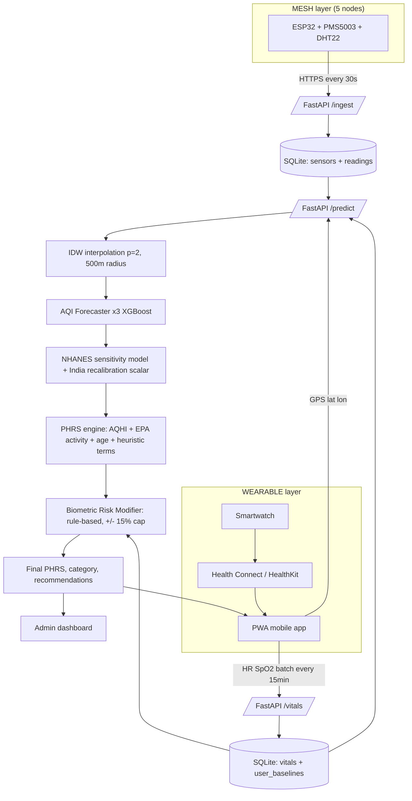
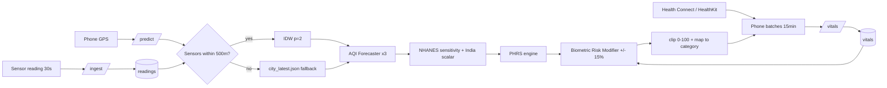
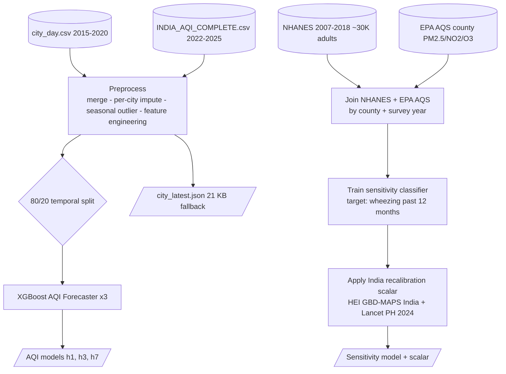

# BREATHE — Invention Disclosure (Revised)

**Project:** BREATHE — A System and Method for Computing a Personalized Health Risk Score from Hyperlocal Air-Quality Data

**Inventors:** Priyanjali; Aditya Choudhary

**Date:** *(to be filled)*

**Scope of this document:** The system is scoped strictly to the **Star Plan** (PHRS ML re-grounding with NHANES + India recalibration), the **Mesh Plan** (GPS-based fixed sensor mesh, Architecture A), and the **Wearable Plan Route A** (Health Connect + HealthKit). Components are marked **STAR**, **MESH**, or **WEARABLE** for traceability.

> **Note on diagrams for Word conversion.** Mermaid code blocks (Figs. 1, 3, 4, 6) should be rendered to PNG/SVG using mermaid.live or equivalent and inserted as images. Figs. 2 and 5 are CAD prompts; pass them to an image-generation tool or a draftsperson and insert the resulting image. After image insertion, this document is ready for conversion to .docx via Pandoc, VS Code → Word, or Google Docs import.

---

## SECTION A — TECHNICAL DETAIL REPORT

---

### 1. Title of the Invention

**Question.** *Title of the Invention.*

**Answer.**

**BREATHE: A System and Method for Computing a Personalized Health Risk Score (PHRS) from Hyperlocal Air-Quality Data Using XGBoost Forecasting, an NHANES-Trained Clinical-Sensitivity Model Recalibrated to Indian Conditions, and a Personal-Baseline Biometric Risk Modifier Derived from Standard OS Health APIs.**

---

### 2. What is the Invention?

**Question.** *What is the Invention? (Should include Problem and Solution statement and general purpose in relation with your invention.)*

**Answer.**

**Field.** Systems and methods for computing a Personalized Health Risk Score (PHRS) from air-quality measurements and individual health data, calibrated for Indian populations.

**Background.** Conventional AQI reporting is spatially coarse (city-level), unpersonalized, reactive, and derived from Western cohorts whose pollutant composition and concentration range do not represent India.

**Summary.** The system computes a PHRS on a 0–100 scale through five interoperating layers and one multiplicative adjustment:

| # | Layer | Mechanism |
|---|---|---|
| 1 | **Hyperlocal exposure** | Five ESP32-based sensor nodes, each coupled to a PMS5003 particulate sensor and a DHT22 temperature/humidity sensor, each transmitting a JSON payload over HTTPS every 30 seconds to a FastAPI `/ingest` endpoint; readings spatially interpolated to the user's GPS coordinates by inverse-distance weighting (Architecture A) within a 500 m trust radius; fallback to a precomputed per-city feature snapshot. (**MESH**) |
| 2 | **AQI forecasting** | Three XGBoost regressors predicting AQI at +1, +3, +7 day horizons from current pollutants, weather, lag/rolling/delta features, season one-hot, calendar features, and event flags; predictions blended 70/30 with momentum and clipped to ±60 / ±120 / ±200 AQI units respectively. (**STAR**) |
| 3 | **Clinical sensitivity** | XGBoost classifier trained on NHANES cycles 2007–2018 (~30,000 adult records), joined to EPA AQS county-level annual PM2.5/NO₂/O₃ averages by survey year, predicting probability of doctor-diagnosed respiratory outcome (e.g., wheezing in past 12 months); output recalibrated to Indian conditions using HEI GBD-MAPS India Special Report 21 IER coefficients and Lancet Planetary Health 2024 PM2.5 mortality scalars; predictions sanity-checked against published Delhi (+10 µg/m³ → +7.09 respiratory + 1.1 cardiac admissions/week) and Mumbai DALY studies. (**STAR**) |
| 4 | **PHRS engine** | Weighted-sum formula combining (i) an AQHI-style exponential air-quality component (Stieb et al. 2008) with PM2.5 coefficient recalibrated to Indian IER; (ii) a pollutant-exceedance component scaled by the sensitivity factor from Layer 3; (iii) a profile component using EPA Exposure Factors Handbook Chapter 6 ventilation multipliers (1.0 / 2.0 / 3.5 / 6.0) and Frontiers Public Health 2024 age odds ratios (~1.20× for <12 and >65); (iv) an AQI-trend penalty (labeled as a design heuristic); scaled by an aggregate condition weight (design heuristic, capped at 2.0); anchored on Indian CPCB AQI category boundaries and NAAQS thresholds. (**STAR**) |
| 5 | **Physiological-adaptation** | Mobile application reads heart rate and SpO₂ via Android Health Connect (`react-native-health-connect`) and Apple HealthKit (`react-native-health`); batches samples to a FastAPI `/vitals` endpoint every 15 minutes; nightly job computes a 7-day rolling median personal baseline; a rule-based Biometric Risk Modifier applies a multiplicative adjustment capped to [0.85, 1.15] based on deviation of latest 30-min HR/SpO₂ window from the personal baseline; modifier defaults to 1.0 when no recent vitals exist. (**WEARABLE**) |
| 6 | **Delivery** | A progressive web application displaying the PHRS, AQI forecasts, condition-specific recommendations, and threshold-based alerts; and an administrator wall dashboard for site-level overview and sensor-health monitoring. (**MESH**) |

**Objects.** (a) An individualized health-risk score; (b) location-specific input via mesh interpolation; (c) multi-horizon prediction; (d) India-specific calibration; (e) physiological adjustment via standard OS APIs without manufacturer-SDK dependency; (f) sub-₹25,000 deployable pilot architecture.

---

### 3. Search Terms

**Question.** *Please provide key words and common industry phrases on the basis of which this invention could be connected with the prior art.*

**Answer.**

Personalized Health Risk Score · individualized AQI · CPCB AQI · NAAQS · HEI GBD-MAPS India · Lancet Planetary Health PM2.5 India · XGBoost AQI forecasting · temporally-constrained forecasting · NHANES respiratory wheezing prediction · EPA AQS county exposure linkage · NHANES exposure-response classifier · clinical-sensitivity machine learning · AQHI Stieb 2008 · EPA Exposure Factors Handbook ventilation · ESP32 PMS5003 DHT22 sensor node · inverse-distance-weighting air quality · hyperlocal air-quality inference · FastAPI ingest predict · Architecture A GPS-based sensor mesh · Android Health Connect react-native-health-connect · Apple HealthKit react-native-health · biometric risk modifier · personal baseline SpO₂ HR · capped multiplicative biometric adjustment · PurpleAir · Clarity Bengaluru · SATVAM IIT Kanpur · Airveda India.

---

### 4. Background of the Invention (Present State of the Art)

**Question.**
*4(a) What are the present technologies that exist in the field of your invention.*
*4(b) What are the limitations of the same?*

**Answer.**

**4(a) Present technologies.** Government AQI portals (CPCB, SAFAR, IQAir); consumer monitors (Atmotube, Kaiterra, Prana Air); Canadian AQHI (Stieb et al. 2008); distributed networks (PurpleAir, Clarity Bengaluru, SATVAM IIT Kanpur, Airveda); industrial-hygiene area monitoring; academic ML AQI forecasting; consumer wearables (Apple Watch, Samsung, Fitbit, Mi Band) and OS health hubs (Health Connect, HealthKit).

**4(b) Limitations.**

| Limitation | Consequence |
|---|---|
| City-level spatial averaging | User's microenvironment unrepresented |
| Generic one-number AQI | Vulnerable individuals receive identical advisory |
| Reactive only | No forward planning |
| Indices derived from Western cohorts | Indian PM composition (biomass / crop-burning dominant) and concentration range (5–10× Western typical) unrepresented |
| Wearables siloed from environment | No linkage between measured physiology and exposure |
| Existing low-cost sensor networks output AQI maps only | No individualized risk model fed by the network |

---

### 5. Prior Art

**Question.** *Please provide the details of the product or process by the help of which the problem solved by the invention was tackled before this invention. Please detail prior technologies, patents, or publications relevant to this invention.*

**Answer.**

| # | Prior art | Description | Gap vs. BREATHE |
|---|---|---|---|
| 1 | CPCB / SAFAR / IQAir / BreezoMeter | City AQI display + generic advisories | Not individualized; no India-recalibrated NHANES sensitivity; no biometric integration |
| 2 | Atmotube, Kaiterra, Prana Air, Airthings | Personal / portable concentration display | No learned sensitivity model; no PHRS engine |
| 3 | AQHI Canada (Stieb et al. 2008) | Population mortality-derived exponential index | Calibrated to Canada; no personalization; no biometric adjustment |
| 4 | PurpleAir / Clarity Bengaluru / SATVAM / Airveda | Distributed low-cost mesh + AQI map | Produces an AQI map; does not produce an individualized risk score |
| 5 | Apple Watch / Samsung / Fitbit / Mi Band + Health Connect / HealthKit | HR / SpO₂ measurement and aggregation | No linkage to air-quality exposure or risk scoring |
| 6 | Academic ML AQI forecasting | Predicts environmental AQI for a region | Forecast is environmental, not personalized health risk |

**Conclusion.** No located prior art combines (i) Architecture A GPS-based mesh-derived hyperlocal exposure, (ii) NHANES-trained clinical-sensitivity classifier with HEI GBD-MAPS India recalibration, (iii) AQHI-structured PHRS engine with EPA-derived activity multipliers and CPCB/NAAQS anchoring, and (iv) personal-baseline biometric risk modifier delivered via standard OS health APIs.

---

### 6. Major Gap Filled

**Question.** *Has the work filled a major gap in the prior art? If yes, a brief description of this gap.*

**Answer.**

**Yes.** The integrated combination of: (i) Architecture A GPS-based fixed mesh of ESP32+PMS5003+DHT22 nodes with IDW spatial interpolation (**MESH**), (ii) an NHANES + EPA AQS-trained clinical-sensitivity classifier recalibrated to India via HEI GBD-MAPS Special Report 21 and Lancet Planetary Health 2024 (**STAR**), (iii) an AQHI-structured, India-anchored PHRS engine with EPA Exposure Factors ventilation multipliers (**STAR**), and (iv) a Health Connect / HealthKit-fed personal-baseline biometric risk modifier capped to ±15 % (**WEARABLE**) — does not appear in the located prior art.

---

### 7. Components of the Invention

**Question.** *Explain the external and internal parts / blocks / systems-subsystems / composition / steps of process of your invention.*

**Answer.**

**Hardware**
- Five ESP32 DevKit V1 microcontrollers (**MESH**)
- Five PMS5003 laser particulate sensors (PM2.5 / PM10) (**MESH**)
- Five DHT22 temperature / humidity sensors (**MESH**)
- Five IP65 weatherproof enclosures with regulated 5 V supply (**MESH**)
- User smartphone (Android or iOS) with a paired smartwatch (Apple Watch, Samsung, Fitbit, Mi Band, boAt) supporting HR and SpO₂ (**WEARABLE**)

**Software**
- FastAPI inference service hosting `/ingest`, `/predict`, `/vitals`, `/cities`, `/health` (**MESH** + **WEARABLE**)
- SQLite time-series store with `sensors`, `readings`, `vitals`, `user_baselines` tables (**MESH** + **WEARABLE**)
- IDW spatial interpolation function (power p=2, default trust radius 500 m) (**MESH**)
- Precomputed per-city feature snapshot (`city_latest.json`, ~21 KB, used as fallback) (**MESH**)
- Three XGBoost AQI Forecaster models (one per horizon) (**STAR**)
- One XGBoost clinical-sensitivity classifier (**STAR**)
- India-recalibration scalar set derived from HEI GBD-MAPS India and Lancet PH 2024 (**STAR**)
- Deterministic PHRS engine implementing AQHI-style AQ component, EPA-derived activity multipliers (1.0 / 2.0 / 3.5 / 6.0), Frontiers PH 2024 age multipliers (~1.20×), aggregate condition weight (design heuristic), weather modifiers (design heuristic), trend penalty (design heuristic) (**STAR**)
- Biometric Risk Modifier function (rule-based; capped [0.85, 1.15]) (**WEARABLE**)
- Mobile application (PWA) using `react-native-health-connect` (Android) and `react-native-health` (iOS) (**WEARABLE**)
- Administrator dashboard for sensor uptime, last-seen timestamps, drift alerts (**MESH**)

---

### 8. How the Invention Works

**Question.** *Explain the working of your invention, the processes involved and the interactive actions taking place between the various components of your invention to give the desired output.*

**Answer.**

**Mesh ingestion path (MESH).** Each node reads PMS5003 (UART2 GPIO16 / 17) and DHT22 (GPIO15) every 30 seconds and POSTs `{device_id, pm25, pm10, temp_c, humidity, timestamp}` to `/ingest`. The backend looks up the device's stored `(lat, lon)` from the `sensors` table and persists the reading.

**Vitals ingestion path (WEARABLE).** The mobile application reads `HeartRateRecord` and `OxygenSaturationRecord` from Android Health Connect (or HealthKit equivalents on iOS) every 15 minutes and POSTs batched samples to `/vitals`. A nightly job computes each user's 7-day rolling median resting HR and SpO₂, excluding samples from high-exposure days, and stores them in `user_baselines`.

**Inference path (MESH + STAR + WEARABLE).** The phone POSTs `(user_id, lat, lon)` to `/predict`. The backend:

1. queries `sensors` and `readings` for all nodes within 500 m of `(lat, lon)`; if empty, falls back to `city_latest.json`;
2. applies IDW (p=2) to estimate PM2.5 / PM10 / temp / humidity at the user's coordinates;
3. assembles the 32-feature vector and runs the three AQI Forecaster models (predictions clipped to ±60 / ±120 / ±200);
4. fetches the user profile and runs the NHANES clinical-sensitivity classifier; applies the Indian recalibration scalar;
5. computes the base PHRS via the engine (AQHI-style AQ + sensitivity-scaled pollutant + EPA activity-multiplied + age-weighted + trend);
6. applies the aggregate condition weight (cap 2.0);
7. reads the latest 30-minute window of HR / SpO₂ from `vitals`, fetches the user's baseline, computes the Biometric Risk Modifier (defaults to 1.0 if no vitals);
8. multiplies the base PHRS by the modifier, clips to [0, 100];
9. maps to one of four categories (Safe 0–30, Moderate 31–60, High 61–80, Critical 81–100) and returns score, category, and recommendations.

**Biometric Risk Modifier formula (WEARABLE).**

```
modifier = 1.0
if spo2 < baseline_spo2 − 2:  modifier *= 1 + 0.03 × (baseline_spo2 − spo2)
if hr > baseline_hr + 10:     modifier *= 1 + 0.005 × (hr − baseline_hr)
return clip(modifier, 0.85, 1.15)
```

Anchored on the Lin et al. 2020 meta-analysis (10 µg/m³ PM2.5 → −0.92 % SDNN, −1.47 % rMSSD) and panel studies showing SBP elevation and SpO₂ depression under acute PM2.5 exposure.

---

### 9. Novelty / Inventive Step

**Question.** *Please state the unique / novel aspect of your invention and how it is different and / or better than the existing technologies.*

**Answer.**

1. **Architecture A GPS-based mesh feeding a PHRS pipeline** — distributed ESP32+PMS5003+DHT22 nodes whose IDW-interpolated readings serve as exposure inputs to a personalized risk pipeline rather than producing a region-level AQI map. (**MESH**)
2. **NHANES-trained clinical-sensitivity model with HEI / Lancet India recalibration** — application of a classifier trained on individual-level US adult outcomes to Indian users via published Indian concentration–response scalars, sanity-checked against published Delhi and Mumbai admission rates. (**STAR**)
3. **AQHI-structured PHRS engine anchored on Indian standards** — AQHI-style exponential air-quality component (Stieb et al. 2008) with PM2.5 coefficient recalibrated to Indian IER, combined with EPA Exposure Factors ventilation multipliers and Frontiers PH 2024 age odds ratios, anchored on CPCB AQI categories and Indian NAAQS thresholds. (**STAR**)
4. **Temporally-constrained AQI forecasting** — momentum-blended weighted XGBoost output with horizon-specific physical change caps (±60 / ±120 / ±200). (**STAR**)
5. **Personal-baseline biometric risk modifier** — rule-based capped multiplicative adjustment using 7-day rolling baselines obtained through standard OS health APIs (Health Connect / HealthKit), avoiding manufacturer-SDK dependency. (**WEARABLE**)

---

### 10. Advantages and Improvements

**Question.** *List advantages and improvements against closest patent and non-patent documents / products in pipeline, explaining technical advancement of the present invention over the existing technologies.*

**Answer.**

| # | Advantage | Anchored to |
|---|---|---|
| 1 | Individualized score from a learned sensitivity model | **STAR** (NHANES) |
| 2 | Localized exposure at the user's GPS position | **MESH** (Architecture A + IDW) |
| 3 | Multi-horizon predictive capability | **STAR** (AQI Forecaster ×3) |
| 4 | India-calibrated absolute scale and effect sizes | **STAR** (CPCB + NAAQS + HEI + Lancet PH) |
| 5 | No proprietary smartwatch SDK dependency | **WEARABLE** (Health Connect + HealthKit) |
| 6 | Operates without mesh, without wearable, with graceful degradation | **MESH** snapshot fallback + **WEARABLE** modifier defaults to 1.0 |
| 7 | Sub-₹25,000 pilot deployment cost | **MESH** (5 nodes + Lightsail) |
| 8 | Compact models + 21 KB snapshot enable edge deployment | **MESH** (Phase 1 lightweighting) |
| 9 | Honest separation of learned components vs design heuristics | **STAR** (Path 2 honesty) |

---

### 11. Alternative Forms / Preferred Embodiments (Variants)

**Question.** *Do you have ideas as to what are the various other / alternative forms in which your invention can be depicted or utilized?*

**Answer.**

- **Sensor variants.** SDS011 may substitute for PMS5003. Optional electrochemical NO₂ / O₃ / CO cells. (**MESH** v2)
- **Spatial-interpolation variants.** IDW (p ∈ [1, 3]) primary; Kriging or graph-neural-network interpolation as v2 upgrades. (**MESH** v2)
- **Trust-radius variants.** 200 m industrial / 500 m–1 km neighborhood. (**MESH**)
- **Connectivity variants.** WiFi (primary), 4G modem fallback. (**MESH**)
- **Localization variants.** GPS (primary, Architecture A); BLE-beacon proximity (Architecture B, future). (**MESH** v2)
- **Biometric-source variants.** Health Connect (Android, primary), HealthKit (iOS, primary); dedicated MAX30102 industrial badge (future). (**WEARABLE** + future)
- **Outcome target variants for sensitivity model.** Wheezing in past 12 months (primary); FEV1 percentile; reported respiratory symptoms. (**STAR**)
- **Delivery variants.** Progressive web app (primary), native React Native app (v2), wall-mounted site dashboard, SMS supervisor alerts. (**MESH** + **WEARABLE**)
- **Inference deployment variants.** Cloud micro-instance (Railway / Render / Lightsail), local Raspberry Pi, edge ESP32 microcomputer. (**MESH**)

---

### 12. CAD / Schematic Diagrams

**Question.** *Please provide final CAD images, line diagrams and Schematic images of the final prototype which illustrates all the essential elements of the invention. Please prepare images in two sets, one completely labeled to details and the second one without any description, legends / labeling or numbering. Include relevant flow charts.*

**Answer.** Source artifacts for the six required figures are provided below. Mermaid blocks should be rendered to PNG / SVG via mermaid.live; CAD prompts should be passed to an image-generation tool or a draftsperson.

#### Fig. 1 — System Architecture (Mermaid)



#### Fig. 2 — Sensor Node Wiring Schematic (CAD prompt)

> *Generate a clean USPTO patent-style schematic of one BREATHE sensor node. Components: ESP32 DevKit V1 (centre); PMS5003 connected to UART2 (PMS TX → ESP32 GPIO16 / RX2; PMS RX → GPIO17 / TX2); DHT22 DATA → GPIO15 with 10 kΩ pull-up to 3V3; 5 V regulated supply to ESP32 VIN and PMS5003; 3V3 from ESP32 to DHT22 VCC; common GND. Show all pin labels, solid black wires, all components inside a dashed IP65 enclosure outline. Sans-serif typography, monochrome, no shadows, no illustrations — patent-figure aesthetic only.*

#### Fig. 3 — Data Flow Diagram (Mermaid)



#### Fig. 4 — PHRS Computation Flowchart (Mermaid)

```mermaid
flowchart TD
    A1[AQI value] --> A["AQHI-style component<br/>e^(coef PM2.5)-1 + ...<br/>PM2.5 coef recalibrated to Indian IER"]
    A2[Pollutants from mesh] --> P["Pollutant exceedance<br/>x sensitivity (NHANES classifier output)<br/>x India recalibration scalar"]
    A3[Profile: age, conditions, activity, hrs outdoors, temp, humidity] --> R["Profile component<br/>EPA activity multiplier 1.0-6.0<br/>+ Frontiers PH 2024 age 1.0-1.25<br/>+ weather modifiers (heuristic)"]
    A4[AQI forecast] --> T["Trend penalty (heuristic)"]
    A -- "x0.50" --> SUM(("Sum"))
    P -- "x0.25" --> SUM
    R -- "x0.20" --> SUM
    T -- "x0.05" --> SUM
    SUM --> BASE[base PHRS]
    BASE --> WC[x aggregate condition weight 1.0-2.0 (heuristic)]
    WC --> BRM[x Biometric Risk Modifier 0.85-1.15]
    BRM --> CLIP["PHRS = clip(0, 100)"]
    CLIP --> CAT[Safe 0-30 / Moderate 31-60 / High 61-80 / Critical 81-100]
```

#### Fig. 5 — Mobile App UI Mockup (CAD prompt)

> *Generate a clean USPTO patent-style mobile-app screen mockup. Top bar: "BREATHE" + city / location label. Centre: circular PHRS gauge showing "72 / High Risk" with colour-coded ring (green → amber → orange → red). Below gauge: row of three small metric cards: AQI 168 / HR 88 bpm / SpO₂ 96 %. Below that: four-point AQI forecast chart (Now / +1 d / +3 d / +7 d). Below chart: recommendation text block (two lines). Bottom: alert banner: "PHRS forecast to reach Critical tomorrow." Sans-serif, monochrome with the four PHRS-category colours only, no shadows, no decorative elements.*

#### Fig. 6 — ML Training Pipeline (Mermaid)



---

### 13. Brief Description of Drawings

**Question.** *Brief description from the researcher / inventor in his own words explaining the images / drawings.*

**Answer.**

- **Fig. 1 — System Architecture.** Six-layer architecture: mesh ingestion, vitals ingestion, ML stages, PHRS engine, biometric modifier, delivery.
- **Fig. 2 — Sensor Node Wiring.** Pin-level schematic of one ESP32+PMS5003+DHT22 node inside an IP65 enclosure.
- **Fig. 3 — Data Flow.** Single-request data flow: sensor and vitals ingestion, GPS-triggered prediction, IDW-or-fallback, ML cascade, modifier, return to phone.
- **Fig. 4 — PHRS Computation.** Four weighted components, condition weight, biometric modifier, four categories.
- **Fig. 5 — Mobile App UI.** PHRS gauge, live vitals, forecast chart, recommendations, alert.
- **Fig. 6 — Training Pipeline.** Offline training producing AQI models and NHANES sensitivity model with India recalibration scalar.

---

### 14. Complete Description and Working Example

**Question.** *Please give complete description including the working examples / working methodology of the invention.*

**Answer.**

**Methodology.** Mesh nodes write to `/ingest` every 30 s. The phone POSTs GPS to `/predict` and batched HR / SpO₂ to `/vitals` every 15 minutes. The backend interpolates exposure (IDW p=2, 500 m radius; snapshot fallback), runs the AQI Forecaster, runs the NHANES sensitivity classifier with the Indian recalibration scalar, evaluates the AQHI-structured PHRS engine, applies the multiplicative Biometric Risk Modifier, clips to [0, 100], maps to category.

**Worked example.** 68-year-old user with heart disease + diabetes, sedentary, 1 h/day outdoors, Delhi winter morning. Mesh IDW at her GPS yields PM2.5 = 180 µg/m³, PM10 = 260 µg/m³, T = 12 °C, RH = 85 %. AQI Forecaster +1 d = 195. NHANES sensitivity classifier × Indian scalar = 1.42 (high). PHRS engine returns base = 80. Vitals from her Apple Watch via Health Connect: 30-min median HR = 96 bpm (baseline 78), SpO₂ = 93 % (baseline 97). Modifier: `1 + 0.03 × (97 − 93) = 1.12`, then `× (1 + 0.005 × (96 − 78)) = 1.12 × 1.09 = 1.22 → clipped to 1.15`. Final PHRS = `clip(80 × 1.15) = 92 → Critical`. Output: indoor-stay + N95 + caregiver push alert.

---

### 15. Experiments / Validation

**Question.** *Please provide details of experiments conducted / third-party validation data if any.*

**Answer.**

**AQI Forecaster (implemented).** XGBoost ×3 trained on 36,723 merged daily city-records (15 Indian cities). 80 / 20 temporal split, no leakage.

| Horizon | Test R² | Test MAE | Test RMSE |
|---|---|---|---|
| +1 d | 0.818 | 13.55 | 34.87 |
| +3 d | 0.628 | 26.37 | 49.86 |
| +7 d | 0.580 | 28.38 | 52.97 |

**NHANES sensitivity classifier (planned, methodology fully specified).** XGBoost on NHANES 2007–2018 (~30,000 adults) joined to EPA AQS county × survey year; target outcome "wheezing in past 12 months." Held-out test evaluation. India recalibration scalars derived from HEI GBD-MAPS Special Report 21 and Lancet Planetary Health 2024. End-to-end sanity check against published Delhi (+10 µg/m³ PM2.5 → +7.09 respiratory + 1.1 cardiac admissions/week) and Mumbai / Delhi DALY studies 1991–2015.

**Biometric Risk Modifier.** Rule-based; not a learned model. Coefficients anchored on Lin et al. 2020 meta-analysis (10 µg/m³ PM2.5 → −0.92 % SDNN, −1.47 % rMSSD) and panel studies on acute SBP elevation and SpO₂ depression under PM2.5 exposure. Tuned via per-watch-brand calibration during pilot.

**System.** FastAPI `/ingest`, `/predict`, `/vitals` functionally verified. Mesh field validation and per-platform Health Connect / HealthKit testing planned at the pilot site.

---

### 16. Public Disclosure / Publications

**Question.** *Please provide details of any public disclosure done / any publication made.*

**Answer.**

No public disclosure, publication, sale, or demonstration as of the disclosure date. Filing is to precede any planned paper or competition submission.

---

### 17. Stage / Level of Development

**Question.** *What is the stage / level of development of the Invention? (a) At a basic conceptualization stage? (b) Completed and results validated?*

**Answer.**

- AQI Forecaster + lightweight FastAPI inference + 21 KB city snapshot: **implemented and verified.**
- Architecture A mesh (5 nodes, IDW, `/ingest`+`/predict` for `(lat, lon)`): **methodology and 4-week sequencing specified; implementation in progress.**
- NHANES sensitivity classifier + India recalibration scalars: **methodology fully specified; training and integration in progress.**
- Health Connect + HealthKit `/vitals` path + Biometric Risk Modifier: **methodology fully specified; integration in progress.**
- PWA + administrator dashboard: **designed; implementation in progress.**

Overall TRL: **4 — validated in a lab environment.**

---

### 18. Proposed Claims

**Question.** *What are the aspects of your disclosure that you want to claim / monopolize?*

**Answer.**

**Independent**

1. A system for computing a Personalized Health Risk Score for a user, said system comprising: (a) a hyperlocal air-quality measurement layer comprising a plurality of fixed sensor nodes each comprising a microcontroller, a particulate-matter sensor, and a temperature/humidity sensor, and producing a location-specific exposure estimate by inverse-distance-weighted spatial interpolation; (b) a machine-learning forecasting layer comprising one or more gradient-boosted regression models producing multi-horizon air-quality predictions temporally constrained by a momentum-blended weighted combination clipped to empirically derived change limits; (c) a clinical-sensitivity modeling layer comprising a classifier trained on the NHANES individual-level outcome dataset joined to environmental exposure data, said classifier's output being recalibrated to Indian conditions using India-specific concentration–response scalars; and (d) a scoring engine combining the foregoing into a normalized score on a 0-to-100 scale.

2. A method comprising the steps of: (i) receiving JSON sensor readings at an ingestion endpoint and persisting them with associated geographic coordinates; (ii) receiving from a mobile device a request containing GPS coordinates; (iii) computing an exposure estimate at said coordinates by inverse-distance weighting over readings from sensor nodes within a configurable trust radius, falling back to a precomputed regional snapshot when no sensor node lies within said radius; (iv) computing a multi-horizon AQI forecast via said gradient-boosted models with momentum-blending and physical change clipping; (v) computing a sensitivity factor from the user's profile and said exposure using said NHANES-trained classifier with India recalibration; (vi) combining the foregoing into a base score via a weighted formula; (vii) applying a multiplicative biometric risk modifier computed from deviation of the user's recent heart-rate and blood-oxygen-saturation measurements from a 7-day rolling personal baseline obtained via a standard OS health interface; and (viii) returning the clipped score with categorical interpretation and recommendations.

**Dependent**

3. The system of claim 1 wherein each sensor node comprises an ESP32 microcontroller, a PMS5003 particulate sensor, and a DHT22 temperature / humidity sensor.
4. The system of claim 1 wherein the spatial interpolation uses inverse-distance weighting with power p=2 and a trust radius of 500 m.
5. The system of claim 1 wherein the multi-horizon predictions are clipped to ±60, ±120, and ±200 AQI units for the +1, +3, and +7 day horizons respectively.
6. The system of claim 1 wherein the scoring engine incorporates an AQHI-derived exponential air-quality component (Stieb et al. 2008), EPA Exposure Factors Handbook ventilation multipliers, Frontiers Public Health 2024 meta-analytic age odds ratios, and is anchored on the CPCB AQI category boundaries and the Indian NAAQS pollutant thresholds.
7. The method of claim 2 wherein said standard OS health interface comprises Android Health Connect on Android and Apple HealthKit on iOS.
8. The method of claim 2 wherein said biometric risk modifier is capped to the closed interval [0.85, 1.15] and defaults to 1.0 when no recent vitals are available.
9. The system of claim 1 wherein the score is mapped to four categories: Safe (0–30), Moderate (31–60), High (61–80), Critical (81–100).
10. The system of claim 1 wherein the India recalibration scalars are derived from HEI GBD-MAPS India Special Report 21 and Lancet Planetary Health 2024.

---

### 19. Novelty / Inventiveness Search

**Question.** *Have you conducted novelty / inventiveness search for your invention? If yes, what are the databases / references used by you? What are the search results?*

**Answer.** Recommended databases: Espacenet, Google Patents, WIPO PATENTSCOPE, Indian Patent Advanced Search System (InPASS).

| # | Reference | Existing idea | Our invention |
|---|---|---|---|
| 1 | CPCB / SAFAR / IQAir | City AQI display | Architecture A mesh + NHANES sensitivity + India recalibration + biometric modifier |
| 2 | AQHI Canada (Stieb 2008) | Population mortality-derived index | Adapted with Indian IER scalar + personalization layer |
| 3 | PurpleAir / Clarity / SATVAM | Distributed sensor map | Mesh feeds individualized PHRS, not just AQI map |
| 4 | Apple Watch / Fitbit + Health Connect / HealthKit | Standalone vitals aggregation | Vitals modify exposure-derived risk via baseline-aware modifier |
| 5 | Academic ML AQI forecasting | Environmental AQI prediction | Forecast feeds personalized risk pipeline |

---

### 20. Non-Obviousness

**Question.** *Do you feel that a person of "average" skill in your area of technology would have arrived at your invention with existing knowledge in public domain? If no, what could be the reasons for the same?*

**Answer.** **No.** The constituent technologies (Architecture A mesh, IDW interpolation, XGBoost regression, NHANES dataset, Health Connect / HealthKit APIs) are individually known. The non-obvious inventive step is the deliberate composition of: (i) Architecture A GPS-based mesh feeding a PHRS pipeline rather than an AQI map; (ii) NHANES + EPA AQS-trained classifier whose output is recalibrated to India via published Indian concentration-response scalars; (iii) AQHI-structured PHRS engine anchored on Indian CPCB and NAAQS standards with EPA-derived activity multipliers and Frontiers PH 2024 age multipliers; and (iv) a baseline-aware capped multiplicative biometric modifier delivered via standard OS health APIs. No prior art combines these specific components into a single PHRS-centric system.

---

### 21. Workable Parameter Ranges

**Question.** *Kindly provide broad workable ranges for all the parameters involved in your invention.*

**Answer.**

| Parameter | Range |
|---|---|
| AQI scale | 0–500 (CPCB) |
| PHRS scale | 0–100 (Safe 0–30, Moderate 31–60, High 61–80, Critical 81–100) |
| AQI forecast horizons | 1, 3, 7 days |
| Forecast change cap | ±60 / ±120 / ±200 AQI units |
| Sensor sampling | 1 s – 15 min (default 30 s) |
| Sensor trust radius | 200 m (industrial) – 1 km (neighborhood); default 500 m |
| IDW power | p ∈ {1, 2, 3}; default 2 |
| PM2.5 measurement | 0–1000 µg/m³ |
| PM10 measurement | 0–2000 µg/m³ |
| Temperature | −20 to 60 °C |
| Humidity | 0–100 % |
| Heart rate | 30–220 bpm |
| SpO₂ | 70–100 % |
| Activity multiplier | 1.0–6.0 (EPA Exposure Factors) |
| Age multiplier | 1.00–1.25 (Frontiers PH 2024) |
| Condition weight | 1.0–2.0 aggregated |
| Biometric modifier | [0.85, 1.15] |
| Vitals sync interval | 15 min |
| Personal baseline window | 7 days rolling |
| Sensor-node parts cost | ₹1,500–2,500 each |
| Pilot deployment cost | ₹17,000–25,000 + ₹500/month cloud |

---

### 22. Commercialization Data

**Question.**
*22(a) Kindly give the names and complete addresses of five different companies which might be interested in the commercial manufacture of this technology.*
*22(b) Kindly enclose a short marketing profile of the technology highlighting the advantages vis-à-vis the prior-art technologies.*

**Answer.**

**22(a) Potential commercial partners.** *(Complete addresses to be inserted by inventor / Technology Transfer Office.)*

1. **Prana Air** — Air-quality monitoring devices, India. *(Gurugram, Haryana.)*
2. **Kaiterra** — Air-quality monitor manufacturer.
3. **IQAir** — Air-quality monitoring and purification solutions.
4. **Airveda** — India-based air-quality monitoring product company.
5. **Domestic Indian IoT / electronics OEM** *(name to be finalized)* for sensor-node manufacturing at scale.
6. **Digital-health or occupational-safety equipment supplier** *(name to be finalized)* for the wearable-channel and industrial workforce deployments.

**22(b) Marketing profile.** BREATHE is positioned as the first **India-calibrated, mesh-fed, individualized predictive air-quality health-risk platform with no manufacturer-SDK dependency for biometric integration**. Key differentiators: India-specific sensitivity recalibration (HEI GBD-MAPS India + Lancet PH 2024); hyperlocal mesh-based exposure (Architecture A, sub-₹2,500 per node); standard-OS-health-API biometric integration (Health Connect + HealthKit); sub-₹25,000 pilot deployment cost; edge-deployable inference. Target segments: chronic-condition patients; vulnerable-population households; industrial workforces; schools, hospitals, and smart-city authorities; wellness and insurance programmes.

---

### 23. Market Potential / Size

**Question.** *Provide available data or information on market potential / size, adoption trends, industry analysis, and projected growth.*

**Answer.** *(Exact figures to be inserted from a current industry report before filing.)*

| Period | Market | Drivers | Notable products |
|---|---|---|---|
| Current | Global air-quality monitoring multi-billion USD; India a high-priority market given urban PM levels (population-weighted mean PM2.5 ≈ 57 µg/m³) | Urban pollution severity, regulation, health awareness | IQAir, Atmotube, Kaiterra |
| +3 yr | Double-digit CAGR continuing | IoT adoption, smart-city programs, digital-health convergence | Prana Air, Dyson sensing, emerging fusion platforms |
| +5 yr | Sustained expansion | Personalized preventive healthcare, AI integration, wearables convergence | Next-generation fused environmental-health platforms |

---

### 24. Inventors

**Question.** *Please provide the names of the inventors involved in the Invention.*

**Answer.**

1. **Priyanjali** — priyanjali.2023@vitstudent.ac.in
2. **Aditya Choudhary** — Aditya.choudhary2023@vitstudent.ac.in

---

### 25. User Information

**Question.**
*25(a) Who all are the potential users of the technology?*
*25(b) Age group of the user?*
*25(c) Expected benefits to the user?*
*25(d) Cost advantage when compared to available solutions.*

**Answer.**

**25(a) Users.** Chronic respiratory and cardiovascular patients; elderly and children; outdoor and industrial workers; athletes; pollution-conscious urban residents; institutional users (schools, hospitals, employers, insurers).

**25(b) Age group.** All ages (1–120 years). Greatest value accrues to the most vulnerable groups — children, elderly, and patients with chronic respiratory or cardiac conditions.

**25(c) Expected benefits.** Individualized warning specific to the user's profile; multi-day forward planning via +1 / +3 / +7-day forecasts; reduced exposure-driven health episodes; caregiver alerting; safer occupational conditions for outdoor and industrial workforces; actionable category-and-recommendation output instead of raw concentration numbers.

**25(d) Cost advantage.** Sub-₹2,500 per sensor-node parts cost. Sub-₹25,000 pilot deployment. No proprietary smartwatch SDK dependency for biometric integration (standard OS APIs). Edge-deployable inference (21 KB snapshot + compact models) minimizes cloud cost. Per-user cost amortizes across all users sharing a mesh deployment.

---

### 26. Technology Readiness Level

**Question.** *What is Technology Readiness Level of your invention? (Tick the appropriate TRL.)*

**Answer.** **Current TRL: 4 — Technology validated in a lab.**

| TRL | Description | Status |
|---|---|---|
| TRL 1 | Basic principles observed | Surpassed |
| TRL 2 | Technology concept formulated | Surpassed |
| TRL 3 | Experimental proof of concept | Surpassed |
| **TRL 4 ✓** | **Validated in lab environment** | **Current — ML inference pipeline implemented and verified; mesh, NHANES sensitivity, and biometric layer fully specified, integration in progress** |
| TRL 5 | Validated in relevant environment | Pending single-site mesh pilot |
| TRL 6–9 | Demonstrated / qualified / operational | Future scope |

**Path to TRL 5.** 8-week pilot at a single site comprising: deployment of 5 sensor nodes (Architecture A); FastAPI backend with IDW + sensor metadata + readings + vitals + baselines tables; PWA + administrator dashboard; co-location calibration; per-watch-brand vitals testing; 2-week field-validation run.

---

### 27. Additional Notes / Remarks

**Question.** *Any additional notes or remarks.*

**Answer.**

- **File before any public disclosure.** Any paper, thesis-repository upload, exhibition, competition entry, or demonstration prior to filing can jeopardize patentability.
- **Conduct a formal prior-art search** (Espacenet, Google Patents, WIPO PATENTSCOPE, InPASS) and engage a registered patent attorney before final claim drafting.
- **Prepare formal labelled and unlabelled drawing sets** from the prompts in Section 12 and from the Mermaid sources.
- **BREATHE is positioned as an informational wellness advisor**, not a regulated medical device. This distinction shapes claim scope and the regulatory pathway.
- **Plan a single-site pilot** to advance from TRL 4 toward TRL 5–6 per the 8-week mesh-plan schedule and to strengthen the experimental evidence in Section 15.

---

*End of disclosure.*
