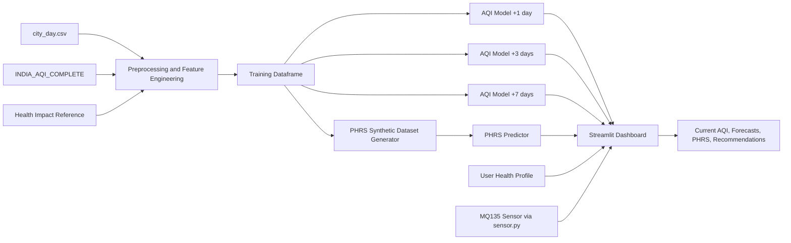
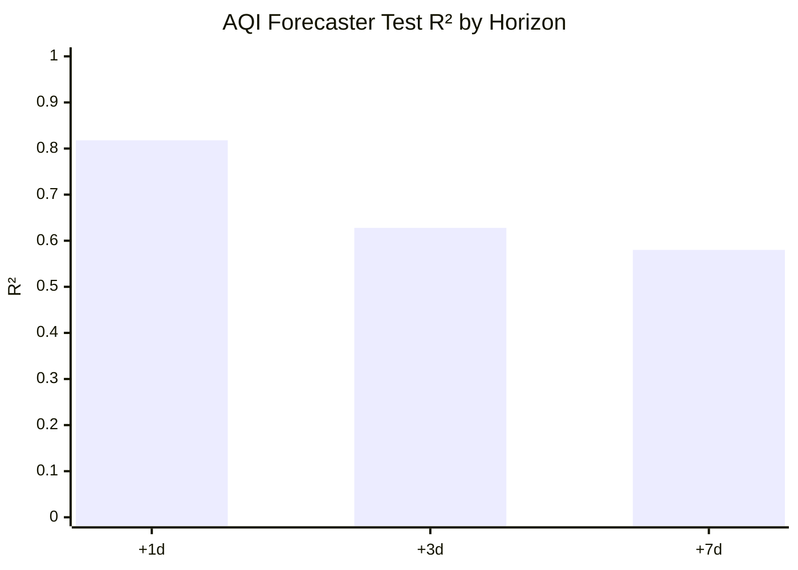
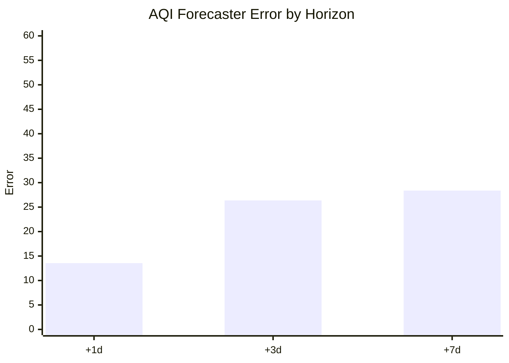
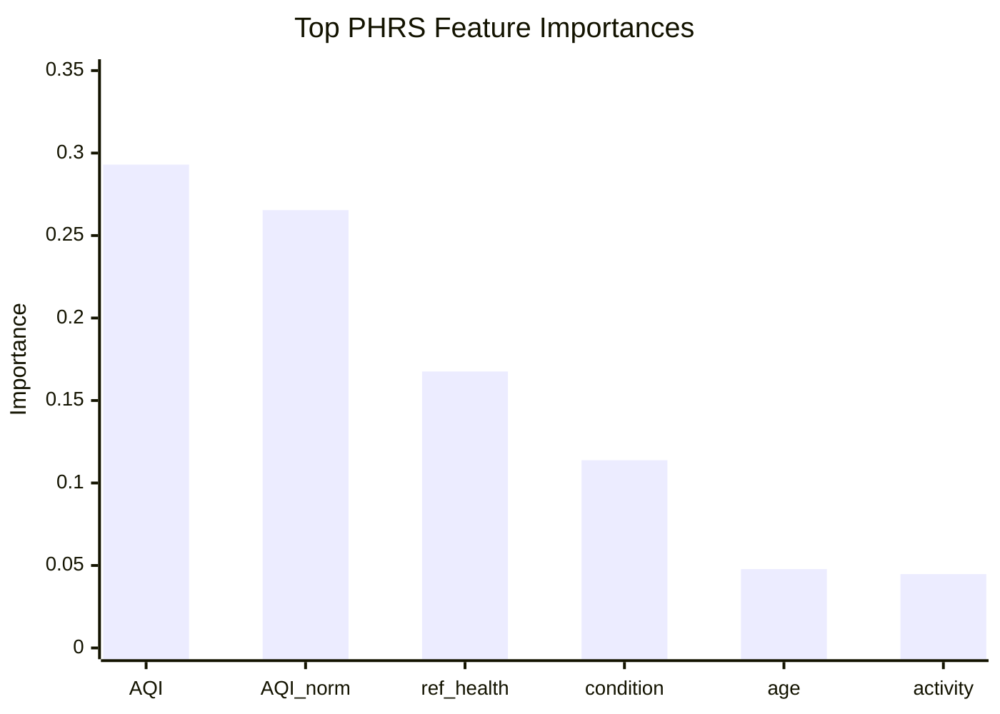

# BioAQI Project Report

## Title
BioAQI: A Personalized Air Quality Forecasting and Health Risk Assessment Platform with Multi-Source Data Fusion, Machine Learning Forecasting, and Real-Time Low-Cost Sensor Integration

## Abstract
BioAQI is a machine-learning-driven air quality and health analytics platform that combines historical AQI data, weather variables, pollutant measurements, health-impact reference data, synthetic personalized health profiles, and real-time MQ135 sensor readings in a unified decision-support system. The project addresses a practical gap in conventional AQI dashboards: standard AQI values represent environmental severity, but not user-specific vulnerability. To bridge this gap, the system includes two predictive layers: an AQI forecaster for 1-day, 3-day, and 7-day horizons, and a Personalized Health Risk Score (PHRS) model that adjusts risk according to age, activity level, exposure duration, and pre-existing conditions. The implementation uses XGBoost-based regressors, engineered temporal and weather-aware features, a Streamlit dashboard, and a serially connected MQ135 sensor for live manual-mode AQI input. On the held-out test set, the AQI forecaster achieved test R² scores of 0.8178 (+1 day), 0.6279 (+3 days), and 0.5801 (+7 days), while the PHRS predictor achieved test R² of 0.9987 and 5-fold CV R² of 0.9978 ± 0.0004. The report presents the problem context, recent literature, architecture, models, experimental setup, results, and a proposed ablation protocol for future validation.

## 1. Introduction and Gap Analysis

### 1.1 Background
Air pollution forecasting has become an important computational problem because air quality affects respiratory health, cardiovascular burden, productivity, and quality of life. Most publicly available dashboards and AQI applications report city-level pollution severity only. They do not model how the same AQI value can pose very different risk levels for a healthy adult, a child, an elderly person, or a patient with asthma or heart disease.

At the same time, modern air-quality systems are often fragmented:

- Forecasting systems focus on pollutant prediction but not user-level health interpretation.
- Health studies quantify exposure burden but do not provide interactive forecasting systems.
- Low-cost sensor systems improve spatial coverage but often suffer from calibration and reliability issues.
- Personalized exposure or routing systems exist, but they usually focus on one pollutant, one city, or one use case.

### 1.2 Problem Statement
The central problem addressed in this project is:

How can we build an affordable, explainable, India-oriented system that predicts air quality over multiple horizons and transforms those forecasts into personalized health risk estimates for real users, while also supporting real-time manual updates from a low-cost gas sensor?

### 1.3 Research Gap
Based on the current codebase and recent literature, the main gaps are:

1. Standard AQI is population-level, not person-level.
2. Many ML forecasting papers optimize predictive accuracy but stop short of converting forecasts into actionable health-risk signals.
3. Sensor-network papers improve coverage and calibration but rarely connect low-cost sensors to a personalized health-scoring engine.
4. Exposure-navigation papers personalize route risk, but they often rely on city-specific infrastructure and do not generalize into a reusable forecasting-and-risk platform.
5. Few practical academic projects combine:
   - multi-source AQI data fusion,
   - weather-aware forecasting,
   - health-reference features,
   - personalized vulnerability modeling,
   - and dashboard deployment in one end-to-end system.

### 1.4 Project Contribution
BioAQI addresses these gaps through the following contributions:

1. A multi-source preprocessing pipeline that merges historical AQI, recent AQI-weather data, and health-impact reference data.
2. A 3-horizon AQI forecasting module using 34 engineered features and temporally constrained inference.
3. A personalized PHRS formulation and PHRS predictor that accounts for user condition, age, outdoor exposure, activity level, pollutant burden, and AQI trend.
4. A Streamlit dashboard that supports both automatic city-based forecasting and manual scenario analysis.
5. Real-time manual-mode integration with an MQ135 sensor through serial communication.

## 2. Literature Review

### 2.1 Overview
Recent work in air-quality intelligence can be grouped into four streams:

1. AQI or PM forecasting with ML and deep learning.
2. Spatiotemporal modeling using graph or attention-based models.
3. Low-cost sensing and sensor calibration using machine learning.
4. Health-aware exposure and personalized decision-support systems.

Table 1 summarizes 15 recent papers most relevant to this project.

### 2.2 Literature Review Table

| No. | Paper | Main Idea | Relevance to BioAQI | Remaining Gap |
|---|---|---|---|---|
| 1 | [Yang et al., 2024](https://www.mdpi.com/2073-4433/15/8/925) | Compared SVR, GBDT, XGBoost, RF, NN, and LSTM for AQI prediction and proposed Bootstrap-XGBoost intervals. | Supports the choice of XGBoost for structured AQI prediction. | Focuses on AQI accuracy, not personalized health risk. |
| 2 | [Gao et al., 2024](https://www.sciencedirect.com/science/article/pii/S1352231024000712) | Compared several ML models for PM2.5 level and exceedance prediction using meteorology and emissions. | Reinforces the role of weather features and multi-model comparisons. | PM-specific and not user-personalized. |
| 3 | [Chen et al., 2024](https://www.mdpi.com/2073-4433/15/7/856) | Proposed self-supervised masked air modeling for air-quality forecasting. | Highlights representation learning for forecasting under limited labels. | More advanced but less interpretable for lightweight deployment. |
| 4 | [Pan et al., 2025](https://www.mdpi.com/2073-4433/16/2/127) | Used transformer architectures and data augmentation to improve PM2.5 extreme-event forecasting. | Important for understanding imbalance handling and long-range temporal modeling. | Focuses on extreme PM2.5, not integrated health-risk scoring. |
| 5 | [Ding and Noh, 2023](https://www.mdpi.com/2073-4433/14/12/1807) | Combined interpretable neural networks with a graph neural network for spatiotemporal air-quality prediction. | Relevant to future spatial extension of BioAQI. | More complex than needed for current city-level dashboard deployment. |
| 6 | [Jiang et al., 2024](https://www.sciencedirect.com/science/article/pii/S0160412024003799) | Built an Urban Air Health Navigation System using XGBoost, interpolation, and route-level exposure minimization. | Strong evidence for linking pollution prediction with user health guidance. | Focuses on route planning, not generalized PHRS. |
| 7 | [Development of a 3D PM2.5 Forecast Model, 2024](https://www.sciencedirect.com/science/article/pii/S2352186424004061) | Used a two-stage random forest model with meteorology, emissions, and remote sensing for 72-hour 3D PM2.5 forecasting. | Shows the value of multimodal data fusion. | Heavy data requirements reduce deployability for lightweight applications. |
| 8 | [Makhdoomi et al., 2025](https://www.nature.com/articles/s41598-025-92019-3) | Proposed virtual monitoring stations using ML for PM2.5 prediction. | Relevant to sparse-station augmentation and future sensor-network scaling. | Does not address individualized risk. |
| 9 | [Chen et al., 2025](https://www.nature.com/articles/s41598-025-88086-1) | Proposed a hybrid deep learning approach with neighborhood selection and spatio-temporal attention. | Relevant for future higher-accuracy spatial forecasting upgrades. | Higher complexity and weaker explainability than tree models. |
| 10 | [Agbehadji and Obagbuwa, 2024](https://www.mdpi.com/2073-4433/15/11/1352) | Systematic review of ML/DL techniques for spatiotemporal air-quality prediction. | Useful for positioning BioAQI against broader forecasting literature. | Reviews prediction, not personalized response. |
| 11 | [Alkhodaidi et al., 2024](https://www.mdpi.com/2227-7080/12/10/198) | Systematic review of ML for particulate-matter estimation. | Highlights ensemble methods, data quality, and validation gaps. | Focused on PM estimation, not dashboard-level decision support. |
| 12 | [Ravindra et al., 2024](https://www.nature.com/articles/s41612-024-00833-9) | Applied ML to improve low-cost air-quality sensor accuracy for large monitoring networks. | Highly relevant to BioAQI’s sensor-integration direction. | Network-level calibration, not AQI-to-health translation. |
| 13 | [Dubey et al., 2024](https://www.mdpi.com/1424-8220/24/17/5675) | Evaluated low-cost CO2 NDIR sensors and calibrated them using ML. | Supports sensor reliability and calibration methodology. | Sensor-specific, not health-aware forecasting. |
| 14 | [Taştan, 2025](https://www.mdpi.com/1424-8220/25/10/3183) | Investigated ML-based calibration and performance evaluation for low-cost IoT air-quality sensors. | Useful for future MQ135 calibration workflows. | Focuses on sensor correction, not personalized health intelligence. |
| 15 | [Sooriyaarachchi et al., 2024](https://www.mdpi.com/1424-8220/24/22/7304) | Proposed causality-driven feature selection for particulate sensor calibration. | Important for robust and interpretable low-cost sensing. | Sensor calibration alone does not solve personalized risk communication. |

### 2.3 Key Takeaways from the Literature
The literature suggests four strong lessons:

1. Tree ensembles remain competitive for structured air-quality data.
2. Weather, temporal memory, and event features are consistently useful.
3. Sensor calibration is essential before trusting dense low-cost deployments.
4. Personalized health-oriented air-quality systems are still relatively uncommon compared with forecasting-only systems.

### 2.4 Positioning of BioAQI
BioAQI occupies a middle ground between pure forecasting studies and pure sensing studies. It is not the most complex spatiotemporal model in the literature, but it is stronger as an end-to-end applied platform because it integrates forecasting, personalization, dashboard deployment, and live sensing in one system.

## 3. Proposed Architecture

### 3.1 System Design
The system is split into two pipelines:

1. Offline training pipeline.
2. Online inference and dashboard pipeline.

### 3.2 Offline Pipeline
The offline layer fuses three datasets:

- `city_day.csv`: daily AQI and pollutant data, 2015-2020.
- `INDIA_AQI_COMPLETE_20251126.csv`: hourly AQI and weather data, aggregated to daily level, 2022-2025.
- `air_quality_health_impact_data.csv`: health-impact reference data used to derive normalized burden features.

The preprocessing pipeline:

1. filters to 15 common major Indian cities,
2. aligns pollutants and weather variables,
3. imputes missing values per city and season,
4. applies season-aware outlier treatment,
5. engineers lag, rolling, event, and normalized AQI features,
6. performs an 80/20 temporal split,
7. trains three AQI models and one PHRS model.

### 3.3 Online Pipeline
The dashboard supports:

- auto mode using the latest city record,
- manual mode for scenario simulation,
- forecast-horizon switching,
- health-profile editing,
- and real-time MQ135 sensor synchronization in manual mode.

### 3.4 Architecture Diagram



### 3.5 Design Rationale
The architecture intentionally uses gradient-boosted trees rather than deeper spatiotemporal models because:

1. the input is structured tabular data,
2. training is fast and stable,
3. feature importance remains available,
4. deployment complexity stays low,
5. dashboard latency remains suitable for interactive use.

## 4. Optimization Algorithm (Optional)

### 4.1 Current Optimization Strategy
The current implementation does not use a separate metaheuristic optimization layer. Instead, it relies on:

- gradient-boosted decision-tree optimization inside XGBoost,
- regularization through `reg_alpha` and `reg_lambda`,
- subsampling and column sampling,
- and early stopping for the AQI forecaster.

The AQI forecaster uses:

- `n_estimators=700`
- `max_depth=6`
- `learning_rate=0.04`
- `subsample=0.8`
- `colsample_bytree=0.8`
- `min_child_weight=3`
- `reg_alpha=0.1`
- `reg_lambda=1.0`
- `early_stopping_rounds=40`

The PHRS model uses:

- `n_estimators=800`
- `max_depth=7`
- `learning_rate=0.04`
- `subsample=0.85`
- `colsample_bytree=0.85`
- `min_child_weight=2`
- `reg_alpha=0.05`
- `reg_lambda=0.8`

### 4.2 Optional Future Optimization Layer
For a publication-strength extension, the following optimization strategies are recommended:

1. Optuna or Bayesian optimization for hyperparameter search.
2. Horizon-specific tuning rather than shared design intuition across all AQI horizons.
3. Multi-objective optimization for jointly minimizing MAE and RMSE.
4. Sensor calibration optimization for mapping MQ135 raw ADC values to AQI or pollutant surrogates.

### 4.3 Why It Is Optional
For the current project, model interpretability, reproducibility, and deployment simplicity matter more than exhaustive hyperparameter search. Therefore, a fixed, hand-tuned XGBoost configuration is acceptable for the present report.

## 5. Prediction Model

### 5.1 AQI Forecasting Model
BioAQI trains three independent XGBoost regressors for AQI prediction at:

- +1 day,
- +3 days,
- +7 days.

The final AQI forecasting feature space contains 34 engineered features, including:

- pollutant concentrations: PM2.5, PM10, NO2, SO2, CO, O3,
- weather variables: temperature, humidity, wind speed, precipitation, wind stagnation,
- event flags: temperature inversion, festival period, crop-burning season,
- calendar signals: month, day-of-week, city encoding, season one-hot vectors,
- temporal memory: AQI lags, rolling mean, rolling standard deviation, velocity terms,
- health-reference features: `ref_health_score`, `ref_resp_cases`,
- India-CPCB-aware normalized AQI.

During inference, the project applies temporal smoothing and physically plausible caps on AQI changes to prevent unrealistic forecast jumps.

### 5.2 PHRS Model
The PHRS target is not directly taken from hospital records. Instead, it is generated from a domain-informed scoring function using:

- AQI burden,
- pollutant exceedance burden,
- age and exposure burden,
- future AQI trend,
- activity multiplier,
- condition weight and co-morbidity adjustment,
- weather modifiers for heat and cold-humidity combinations.

This synthetic target is then learned by a separate XGBoost regressor so that real-time inference in the dashboard remains fast.

### 5.3 PHRS Formula
The implemented PHRS design can be summarized as:

```text
PHRS = clip(
    [W_AQI * AQI_component * activity_multiplier]
  + [W_POLLUTANT * pollutant_component * activity_multiplier]
  + [W_PROFILE * profile_component]
  + [W_TREND * trend_component]
) * condition_weight
```

where:

- `W_AQI = 0.50`
- `W_POLLUTANT = 0.25`
- `W_PROFILE = 0.20`
- `W_TREND = 0.05`

### 5.4 Interpretability Insight
Top 10 PHRS feature importances from the trained model are:

| Rank | Feature | Importance |
|---|---|---:|
| 1 | AQI | 0.2930 |
| 2 | AQI_norm_india | 0.2654 |
| 3 | ref_health_score | 0.1676 |
| 4 | condition_enc | 0.1138 |
| 5 | age | 0.0478 |
| 6 | activity_enc | 0.0448 |
| 7 | AQI_lag1 | 0.0219 |
| 8 | hours_outdoors | 0.0106 |
| 9 | CO | 0.0092 |
| 10 | PM10 | 0.0073 |

This ranking confirms that the PHRS model is primarily driven by ambient AQI burden and health sensitivity, which is consistent with the intended design.

## 6. Experimental Setup

### 6.1 Data
The project uses three datasets:

| Dataset | Role | Coverage |
|---|---|---|
| `city_day.csv` | historical daily AQI and pollutants | 2015-2020 |
| `INDIA_AQI_COMPLETE_20251126.csv` | recent AQI-weather data, hourly aggregated to daily | 2022-2025 |
| `air_quality_health_impact_data.csv` | health-reference lookup for burden features | external reference |

### 6.2 Processed Training Set
From the actual preprocessing pipeline in this repository:

- total processed daily rows: 36,723
- training rows: 29,378
- test rows: 7,345
- number of engineered features: 34
- number of cities: 15
- source composition:
  - `city_day`: 18,573 rows
  - `india_complete`: 18,150 rows

### 6.3 PHRS Dataset
The PHRS model is trained on a synthetic personalized dataset generated from the AQI training split only:

- PHRS samples generated: 146,890
- profiles per AQI row: 5
- train/test split for PHRS model: random 80/20 inside the PHRS training routine
- 5-fold cross-validation performed for the PHRS model

### 6.4 Evaluation Metrics
The project uses:

- R²
- MAE
- RMSE
- 5-fold CV R² for the PHRS predictor

### 6.5 Software Stack
The implementation uses:

- Python
- pandas
- numpy
- scikit-learn
- XGBoost
- Streamlit
- Plotly
- pyserial

### 6.6 Hardware Setup
For the real-time sensing component:

- Arduino-compatible board
- MQ135 gas sensor
- serial communication via `sensor.py`
- empirical raw-ADC-to-AQI mapping for live dashboard use

## 7. Results, Graphs, Comparisons, and Metrics

### 7.1 Quantitative Results

| Model | Test R² | Test MAE | Test RMSE | Train R² |
|---|---:|---:|---:|---:|
| AQI Forecaster +1d | 0.8178 | 13.551 | 34.873 | 0.7988 |
| AQI Forecaster +3d | 0.6279 | 26.366 | 49.857 | 0.7136 |
| AQI Forecaster +7d | 0.5801 | 28.381 | 52.969 | 0.7155 |
| PHRS Predictor | 0.9987 | 0.512 | 0.829 | 0.9993 |

Additional PHRS generalization:

- 5-fold CV R² = 0.9978 ± 0.0004

### 7.2 Result Interpretation
The forecasting results show the expected degradation in accuracy with increasing horizon length:

1. +1-day forecasting is the most reliable because short-term AQI retains high temporal autocorrelation.
2. +3-day forecasting remains useful but is noticeably weaker.
3. +7-day forecasting is the least accurate, reflecting accumulated uncertainty in atmospheric dynamics.

The PHRS model achieves near-perfect performance on its synthetic target. This is expected because the model is effectively learning a domain-designed scoring function rather than a noisy clinical label. Therefore, the PHRS model should be interpreted as a fast surrogate of the handcrafted risk formula, not as direct clinical validation.

### 7.3 Suggested Graph 1: AQI Test R² by Horizon



### 7.4 Suggested Graph 2: AQI Error by Horizon



### 7.5 Suggested Graph 3: PHRS Feature Importance



### 7.6 AQI Feature Comparison Across Horizons
Top features for the AQI models reveal a consistent pattern:

- `AQI_norm_india` dominates short-horizon prediction.
- `AQI_roll7_mean` becomes more dominant at +3 days and +7 days.
- event and season signals such as `Temp_Inversion` and `season_Monsoon` remain useful.
- `ref_health_score` appears among the important features, suggesting that pollution severity and health burden bins carry predictive value even for AQI forecasting.

| Horizon | Most Important Features |
|---|---|
| +1 day | AQI_norm_india, ref_health_score, AQI_roll7_mean, CO, season_Monsoon |
| +3 days | AQI_roll7_mean, AQI_norm_india, ref_health_score, NO2, city_enc |
| +7 days | AQI_roll7_mean, AQI_norm_india, AQI_lag1, city_enc, AQI_lag7 |

### 7.7 Comparative Discussion
Compared with recent literature, BioAQI is not the most complex forecasting model. However, it is more complete as an applied system because it combines:

- forecasting,
- personalization,
- dashboard visualization,
- and live sensor interaction.

This gives the project stronger practical utility even if some high-end spatial deep-learning papers may outperform it on narrowly defined forecasting benchmarks.

## 8. Ablation Study

### 8.1 Current Status
The current repository does not store ablation checkpoints or numerical ablation runs. Therefore, this section is presented as a transparent, report-ready ablation design rather than a fabricated empirical result section.

### 8.2 Proposed Ablation Variants

| Variant | Description | Expected Effect |
|---|---|---|
| A0 | Remove weather variables | Lower AQI forecast accuracy, especially during seasonal transitions |
| A1 | Remove event flags (`Temp_Inversion`, `Festival_Period`, `Crop_Burning_Season`) | Worse handling of episodic pollution spikes |
| A2 | Remove AQI temporal memory features (`lag`, `roll`, `delta`) | Large drop in short-horizon performance |
| A3 | Remove `AQI_norm_india` | Reduced alignment with CPCB risk bands and lower stability |
| A4 | Remove health-reference features (`ref_health_score`, `ref_resp_cases`) | Slightly weaker AQI forecasting and PHRS personalization |
| A5 | Disable temporal smoothing and max-delta constraints at inference | More volatile but less physically plausible AQI predictions |
| A6 | PHRS without activity multiplier | Lower sensitivity to user behavior |
| A7 | PHRS without multi-condition aggregation | Underestimates co-morbidity burden |

### 8.3 Recommended Ablation Metrics
Each ablation should report:

- test R²
- MAE
- RMSE
- stability of forecast trajectories
- qualitative effect on dashboard recommendations

### 8.4 Expected Outcome
The most critical components are likely:

1. AQI lag and rolling features,
2. CPCB-aware AQI normalization,
3. weather variables,
4. PHRS condition weighting,
5. temporal smoothing for realistic inference.

### 8.5 Important Reporting Note
If this report is submitted formally, the ablation section should either:

1. be experimentally completed, or
2. be explicitly labeled as future work.

At present, the honest interpretation is that BioAQI contains strong design-motivated components, but the repository does not yet provide measured ablation scores.

## 9. Conclusion
BioAQI demonstrates that an end-to-end personalized air-quality intelligence system can be built by combining multi-source environmental data, tree-based forecasting, synthetic health-risk modeling, and live low-cost sensor input. The AQI forecaster performs best at short horizons and remains useful across 3-day and 7-day horizons, while the PHRS predictor provides a rapid approximation of a structured personalized risk formula. The project’s primary strength is system integration: it converts raw environmental data into user-facing health interpretation rather than stopping at city-level pollution prediction.

The project also has clear limitations. First, PHRS labels are synthetic and formula-derived, so strong PHRS metrics indicate consistency with the designed risk function rather than clinical ground truth. Second, the low-cost MQ135 pipeline uses an empirical raw-ADC-to-AQI mapping, which is useful for interactive prototyping but not a substitute for full reference-grade calibration. Third, a formal ablation study has not yet been executed.

Despite these limitations, BioAQI is a strong applied research prototype. Future work should focus on:

1. sensor calibration using reference instruments and ML correction,
2. hyperparameter optimization,
3. spatial interpolation or graph-based forecasting,
4. external validation using real health outcomes,
5. and formal ablation experiments for publication-quality evidence.

## References
1. Yang, J., Tian, Y., and Wu, C.H. (2024). Air Quality Prediction and Ranking Assessment Based on Bootstrap-XGBoost Algorithm and Ordinal Classification Models. Atmosphere. https://www.mdpi.com/2073-4433/15/8/925
2. Gao, Z. et al. (2024). Predicting PM2.5 levels and exceedance days using machine learning methods. Atmospheric Environment. https://www.sciencedirect.com/science/article/pii/S1352231024000712
3. Chen, S. et al. (2024). Improving Air Quality Prediction via Self-Supervision Masked Air Modeling. Atmosphere. https://www.mdpi.com/2073-4433/15/7/856
4. Pan, P., Malarvizhi, A.S., and Yang, C. (2025). Data Augmentation Strategies for Improved PM2.5 Forecasting Using Transformer Architectures. Atmosphere. https://www.mdpi.com/2073-4433/16/2/127
5. Ding, H., and Noh, G. (2023). A Hybrid Model for Spatiotemporal Air Quality Prediction Based on Interpretable Neural Networks and a Graph Neural Network. Atmosphere. https://www.mdpi.com/2073-4433/14/12/1807
6. Jiang, P. et al. (2024). An exploration of urban air health navigation system based on dynamic exposure risk forecast of ambient PM2.5. Environment International. https://www.sciencedirect.com/science/article/pii/S0160412024003799
7. Development of a data-driven three-dimensional PM2.5 forecast model based on machine learning algorithms. (2024). Environmental Technology and Innovation. https://www.sciencedirect.com/science/article/pii/S2352186424004061
8. Makhdoomi, A., Sarkhosh, M., and Ziaei, S. (2025). PM2.5 concentration prediction using machine learning algorithms: an approach to virtual monitoring stations. Scientific Reports. https://www.nature.com/articles/s41598-025-92019-3
9. Chen, G. et al. (2025). A hybrid deep learning air pollution prediction approach based on neighborhood selection and spatio-temporal attention. Scientific Reports. https://www.nature.com/articles/s41598-025-88086-1
10. Agbehadji, I.E., and Obagbuwa, I.C. (2024). Systematic Review of Machine Learning and Deep Learning Techniques for Spatiotemporal Air Quality Prediction. Atmosphere. https://www.mdpi.com/2073-4433/15/11/1352
11. Alkhodaidi, A. et al. (2024). The Role of Machine Learning in Enhancing Particulate Matter Estimation: A Systematic Literature Review. Technologies. https://www.mdpi.com/2227-7080/12/10/198
12. Ravindra, K. et al. (2024). Enhancing accuracy of air quality sensors with machine learning to augment large-scale monitoring networks. npj Climate and Atmospheric Science. https://www.nature.com/articles/s41612-024-00833-9
13. Dubey, R. et al. (2024). Low-Cost CO2 NDIR Sensors: Performance Evaluation and Calibration Using Machine Learning Techniques. Sensors. https://www.mdpi.com/1424-8220/24/17/5675
14. Taştan, M. (2025). Machine Learning-Based Calibration and Performance Evaluation of Low-Cost Internet of Things Air Quality Sensors. Sensors. https://www.mdpi.com/1424-8220/25/10/3183
15. Sooriyaarachchi, V. et al. (2024). Causality-Driven Feature Selection for Calibrating Low-Cost Airborne Particulate Sensors Using Machine Learning. Sensors. https://www.mdpi.com/1424-8220/24/22/7304

## Appendix A: Repository-Derived Facts Used in This Report

- Processed rows after preprocessing: 36,723
- Train rows: 29,378
- Test rows: 7,345
- Engineered features: 34
- Cities used: 15
- PHRS training samples generated: 146,890
- AQI model artifacts:
  - `models/aqi_forecaster_h1.joblib`
  - `models/aqi_forecaster_h3.joblib`
  - `models/aqi_forecaster_h7.joblib`
- PHRS model artifact:
  - `models/phrs_model.joblib`
- Metrics source:
  - `models/metrics.json`
